# 基于 TPM 2.0/vTPM 的密钥管理与数据加解密系统总体设计

版本：v1.0  
状态：集成设计稿  
适用范围：私有云、虚拟化平台、具备 TPM 2.0/vTPM 能力的多节点密钥服务集群  
主要实现语言：Go  

## 0. 文档定位

本文作为后续需求拆分、业务功能实现、详细设计补充、评审和验收的主文档。

本文做出的关键取舍：

1. 第一阶段优先实现业务闭环：密钥管理、数据加解密、DataKey、基础认证授权、基础审计和基础生命周期。
2. 运维、审计增强、恢复演练、外部锚点、审批流、跨语言 SDK 等作为后续阶段逐步接入。
3. 管理面、密钥面、数据面、证明面、审计面在架构上解耦；P0 可以逻辑隔离，生产增强阶段再逐步物理隔离。
4. mTLS 不作为 P0 必选项。P0 采用 HTTPS + Token/JWT/HMAC 请求签名 + 网络隔离 + IP allowlist 的轻量认证方案，mTLS 作为 P1/P2 高保障增强。

### 0.1 文档逻辑顺序

本文按“目标边界 -> 安全不变量 -> 架构分层 -> 核心机制 -> 业务流程 -> 工程落地 -> 横向质量 -> 实施路线”的顺序组织。这样可以先明确系统不能突破的安全边界，再讨论如何实现功能，最后讨论如何把系统稳定、可控地交付到生产。


章节阅读建议：

| 读者 | 优先章节 |
| --- | --- |
| 架构评审 | 1、2、3、4、5、20-28 |
| 后端开发 | 6、7、8、9、10、11、12、13、17、19 |
| 安全评审 | 2、4、5、14、20、22、26 |
| 运维/SRE | 15、18、19、23、24、25、28 |
| 业务接入方 | 6、7、8、11、16、18 |

### 0.2 设计图索引

| 图 | 位置 | 用途 |
| --- | --- | --- |
| 文档逻辑图 | 0.1 | 说明总体设计阅读顺序。 |
| 总体架构图 | 4.1 | 展示核心组件和依赖。 |
| 部署拓扑图 | 4.2 | 展示 P1/P2 推荐部署形态。 |
| 模块依赖图 | 4.6 | 约束 Go 代码模块依赖方向。 |
| 密钥层级图 | 6.1 | 展示 NRWK、CRK、DEK、业务数据关系。 |
| P0-P3 能力依赖图 | 7.8 | 展示阶段能力演进。 |
| 关键业务流程图 | 9 | 展示节点准入、初始化、创建、加密、解密、轮转、DataKey、销毁。 |
| 数据模型 ERD | 11.1 | 展示核心表关系。 |
| API 调用关系图 | 12.4 | 展示外部客户端、API、服务和存储关系。 |
| 状态机图 | 14 | 展示 Key、KeyVersion、Node 状态。 |
| 恢复演练图 | 16.3 | 展示恢复 Runbook。 |
| 技术路线图 | 20.3 | 展示 P0-P3 技术演进主线。 |
| 实施流程图 | 21.7 | 展示从设计到上线的执行路径。 |
| 安全边界图 | 24.5 | 展示信任边界和攻击面控制。 |
| 高可用拓扑图 | 27.5 | 展示多副本和故障隔离。 |
| 可观测链路图 | 28.4 | 展示日志、指标、审计和告警流向。 |
| 攻防推演图 | 25.2 | 展示从攻击路径到加固控制的映射。 |

## 1. 专有名词和缩写释义

本章用于统一本文中的专有名词、英文缩写和关键概念。后续章节如无特别说明，均采用本章定义。

### 1.1 密钥与密码学术语

| 术语 | 英文/缩写 | 释义 |
| --- | --- | --- |
| 根密钥 | Root Key | 位于密钥层级最高层的密钥材料，本文主要指由 TPM/vTPM 保护的集群根密钥相关材料。 |
| 节点根包装密钥 | NRWK, Node Root Wrapping Key | 由 TPM/vTPM 生成或保护的节点级不可导出密钥，用于封装或解封 CRK envelope。 |
| 集群根密钥 | CRK, Cluster Root Key | 集群级根密钥，用于封装/解封 DEK。CRK 明文不可通过 API、数据库、日志或备份导出。 |
| 数据密钥 | DEK, Data Encryption Key | 直接或间接用于加密业务数据的密钥。DEK 入库时必须被 CRK 封装。 |
| 密钥加密密钥 | KEK, Key Encryption Key | 用于加密其他密钥的密钥。本文中 CRK 可视为 DEK 的 KEK。 |
| 数据密钥接口 | DataKey | 返回明文 DataKey 与 wrapped DataKey 的接口，主要用于客户端信封加密或大对象加密。 |
| 包装密钥 | Wrapped Key | 被上级密钥封装后的密钥密文，例如 wrapped DEK。 |
| 信封加密 | Envelope Encryption | 使用 DEK 加密数据、使用 KEK/CRK 加密 DEK 的分层加密模式。 |
| 密文封套 | Envelope | 本系统定义的密文容器，保存算法、版本、nonce、AAD 摘要、密文和认证标签等信息。 |
| 认证附加数据 | AAD, Additional Authenticated Data | AEAD 加密中参与认证但不加密的数据，用于绑定租户、key、version、purpose 等上下文。 |
| 认证加密 | AEAD | 同时提供机密性、完整性和认证能力的加密模式，例如 AES-GCM、SM4-GCM。 |
| 随机数/一次性值 | Nonce | GCM 等模式下每次加密必须唯一的值，本文采用租约方式防止复用。 |
| 认证标签 | Tag | AEAD 输出的完整性校验值，解密时必须校验通过。 |
| 初始化向量 | IV | CBC 等分组模式使用的初始化向量，不应复用且必须按模式要求生成。 |
| 加密后认证 | EtM, Encrypt-then-MAC | 先加密再对密文计算 MAC 的组合方式，用于 CBC 兼容模式。 |
| 密钥有效期 | Cryptoperiod | 密钥被允许用于保护数据的时间窗口。 |
| 密钥轮转 | Key Rotation | 生成新密钥版本并切换新加密使用版本，旧版本通常保留解密能力。 |
| 仅解密 | Decrypt-only | 密钥或算法不再允许新加密，但仍允许解密历史密文的状态。 |

### 1.2 TPM、证明与可信计算术语

| 术语 | 英文/缩写 | 释义 |
| --- | --- | --- |
| 可信平台模块 | TPM, Trusted Platform Module | 硬件或固件安全模块，提供密钥保护、度量、Quote、随机数等能力。 |
| 虚拟 TPM | vTPM | 虚拟化环境提供的 TPM 实现，其信任边界还依赖宿主机和虚拟化平台。 |
| 平台配置寄存器 | PCR, Platform Configuration Register | TPM 中记录启动链和运行环境度量值的寄存器。 |
| Quote | TPM Quote | TPM 使用证明密钥对 PCR 值和 nonce 进行签名的证明材料。 |
| 事件日志 | Event Log | 启动和度量事件记录，用于解释 PCR 值如何形成。 |
| 证明密钥 | AK, Attestation Key | TPM 中用于生成 Quote 或证明 TPM 身份的密钥。 |
| 远程证明 | Remote Attestation | 节点向证明服务提交 Quote/Event Log，由服务判断节点是否可信。 |
| 证明基线 | Attestation Baseline | 被允许的固件、启动链、OS、PCR、策略摘要等可信基准。 |
| 证明纪元 | Attestation Epoch | 节点证明状态的版本或时序标识，用于绑定 lease 和节点 READY 状态。 |
| TPM Policy Session | Policy Session | TPM 受策略约束的授权会话，可绑定 PCR、AuthValue、PolicyAuthorize 等条件。 |
| 防回滚 | Anti-rollback | 防止系统恢复到旧密钥、旧策略、旧 epoch 或旧状态的机制。 |

### 1.3 架构、服务与模块术语

| 术语 | 英文/缩写 | 释义 |
| --- | --- | --- |
| 管理面 | Management Plane | 提供密钥创建、查询、启停、轮转、销毁、策略管理等能力的平面。 |
| 数据面 | Data Plane | 提供 Encrypt、Decrypt、DataKey 等高频数据加解密能力的平面。 |
| 密钥面 | Key Plane | 执行 CRK 解封、DEK 封装/解封、DEK lease 签发的受控内部平面。 |
| 证明面 | Attestation Plane | 负责节点证明、基线管理、READY 状态判定的平面。 |
| 审计面 | Audit Plane | 负责审计事件、WAL、哈希链、外部锚点和验证报告的平面。 |
| Management API | Management API | 管理 API，面向管理员或自动化平台。 |
| Crypto API | Crypto API | 数据 API，面向业务服务或 SDK。 |
| Key Resolver | Key Resolver | 内部密钥解析与 lease 签发组件，负责受控解封 CRK 和处理 DEK。 |
| Attestation Service | Attestation Service | 远程证明服务，校验 Quote、Event Log、PCR 和基线。 |
| Lifecycle Worker | Lifecycle Worker | 异步生命周期任务执行器，处理轮转、销毁、重封装、缓存失效等任务。 |
| Audit Forwarder | Audit Forwarder | 审计事件转发组件，负责 WAL 回放、哈希链和外部 sink 对接。 |
| SDK | Software Development Kit | 业务接入开发包，封装认证、Envelope、DataKey、加解密和错误处理。 |
| Provider | Provider | 可替换的底层能力提供者，例如 TPM Provider、RootKeyProvider、AuditSink Provider。 |

### 1.4 认证、授权与安全治理术语

| 术语 | 英文/缩写 | 释义 |
| --- | --- | --- |
| 令牌 | Token | 调用方携带的身份凭据，可为 JWT、OIDC token 或内部 service token。 |
| JSON Web Token | JWT | 一种常见的声明式 token 格式，包含 issuer、audience、subject、scope、过期时间等声明。 |
| OpenID Connect | OIDC | 基于 OAuth2 的身份认证协议，常用于服务或用户身份联合认证。 |
| HMAC | Hash-based Message Authentication Code | 基于共享密钥和哈希函数的消息认证码，用于请求签名和防篡改。 |
| 双向 TLS | mTLS | 客户端和服务端都使用证书互相认证的 TLS 模式。 |
| 基于属性的访问控制 | ABAC | 根据租户、角色、scope、key、用途、节点状态等属性进行授权判断。 |
| 基于角色的访问控制 | RBAC | 根据角色授予权限的授权模型。 |
| 最小权限 | Least Privilege | 只授予完成任务所需的最小权限。 |
| 高风险操作 | High-risk Operation | 导出、销毁、CRK 轮转、节点注册、策略降级等需要更强审计或审批的操作。 |
| 双人审批 | Four-eyes Principle | 单人无法完成高风险操作，至少需要第二人审批。 |
| 失败关闭 | Fail-closed | 依赖异常时拒绝操作，而不是降级为不安全成功。 |

### 1.5 数据、可靠性与运维术语

| 术语 | 英文/缩写 | 释义 |
| --- | --- | --- |
| 预写日志 | WAL, Write-Ahead Log | 操作完成前先持久化日志，本文用于高风险审计和恢复证据。 |
| 哈希链 | Hash Chain | 每条记录包含上一条哈希和当前哈希，用于检测删除、重排、截断和篡改。 |
| 外部锚点 | External Anchor | 将审计链头发布到外部不可变存储或透明日志，用于事后验证。 |
| 一次性请求标识 | Idempotency-Key | 客户端提供的幂等键，用于防止重试导致重复创建或重复执行。 |
| 发件箱模式 | Outbox Pattern | 业务事务内写事件表，再由后台 worker 异步可靠投递。 |
| 服务等级目标 | SLO | 对延迟、可用性、错误率等服务质量指标的目标。 |
| 服务等级指标 | SLI | 衡量 SLO 的具体指标，例如 p95 延迟、错误率。 |
| 恢复时间目标 | RTO | 故障后恢复服务所需的目标时间。 |
| 恢复点目标 | RPO | 故障时允许丢失数据的最大时间窗口。 |
| 运行手册即代码 | Runbook as Code | 将恢复、演练、巡检等运维流程代码化和自动化。 |
| 软件物料清单 | SBOM | 软件依赖、组件和版本清单，用于供应链安全治理。 |
| 一致性测试套件 | Conformance Suite | 用于验证不同 SDK、Provider 或实现是否符合统一协议和格式的测试集合。 |

## 2. 设计目标与边界

### 2.1 建设目标

建设一个以 TPM 2.0/vTPM 为可信根的多节点密钥管理与数据加解密系统，提供：

- 根密钥保护：集群根密钥由 TPM/vTPM 保护，用户不可见，不可通过 API 导出。
- 数据密钥管理：DEK 由根密钥封装后存储在集群共享数据库中，支持创建、查询、停用、销毁、更新、轮转和密文导入导出。
- 数据加解密：支持 AES/SM4，支持 GCM/CBC/ECB 等分组模式策略化管理，默认优先 GCM，ECB 默认禁用或仅兼容解密。
- 指令集加速：优先使用 Go 标准库和平台 AES-NI/ARMv8 Crypto Extension，SM4 使用经过审查的成熟实现并预留硬件加速扩展点。
- 多节点部署：提供 HTTPS 服务，支持横向扩展、共享数据库、缓存失效、租约与状态一致性。
- Token 鉴权：支持轻量认证方案，避免 P0 阶段强依赖复杂 mTLS 部署。
- 安全治理：分阶段引入远程证明、审计哈希链、外部锚点、恢复演练、策略签名和审批。

### 2.2 非目标

- 不把 TPM 作为高吞吐数据加解密设备；TPM 只承担可信根、密钥解封、证明和防回滚锚点。
- 不提供 CRK 明文导入、明文导出或普通文件备份。
- 不通过服务端 API 导出 DEK 明文。DataKey 接口仅在受控业务场景返回短期明文数据密钥，并建议优先由 SDK 内部使用。
- 不承诺在宿主机、内核或同权限进程完全失陷时仍保护正在使用的明文 DEK。
- 不在 P0 完整实现审计外部锚点、自动化恢复演练、复杂审批流和跨语言 SDK。

### 2.3 设计原则

| 原则 | 说明 |
| --- | --- |
| 业务闭环优先 | 先实现密钥创建、查询、轮转、加密、解密、DataKey 和基础认证，形成可测试闭环。 |
| 平面解耦 | 管理能力、加解密能力、TPM 解封能力、证明能力和审计能力通过接口隔离。 |
| 根密钥最小暴露 | CRK 只在受控函数作用域短时存在，数据面不持有 CRK，不挂载 TPM。 |
| 信封加密 | CRK 保护 DEK，DEK 保护业务数据；数据库只保存 wrapped DEK。 |
| 策略驱动 | 算法、模式、密钥长度、nonce、AAD、状态迁移均由策略控制。 |
| 默认关闭危险能力 | ECB、明文导入、明文导出、弱算法、长 TTL 缓存默认关闭。 |
| 可演进认证 | P0 使用低复杂度 Token/JWT/HMAC；高保障场景可升级 mTLS 和工作负载身份。 |
| 失败关闭 | TPM、证明、鉴权、nonce、审计关键路径失败时拒绝相关操作。 |

## 3. 安全不变量

以下约束必须贯穿设计、实现、测试和运维：

| 编号 | 不变量 | 实现要求 |
| --- | --- | --- |
| INV-01 | CRK 明文不可导出 | 不通过 API、数据库、日志、备份或普通文件暴露 CRK 明文。 |
| INV-02 | 数据面不持有 CRK | `crypto-api` 不访问 TPM，不读取 `crk_node_envelopes`，只持短期 DEK lease。 |
| INV-03 | DEK 入库必须封装 | `key_versions.wrapped_dek` 只能保存 CRK 封装密文。 |
| INV-04 | 未认证节点不得参与服务 | 未通过基础认证和节点状态检查的节点不得获得 DEK lease。P1 起叠加远程证明。 |
| INV-05 | GCM nonce 不复用 | 使用 `nonce_domain + counter` 或等价租约机制，计数区间先持久化后使用。 |
| INV-06 | 轮转原子切换 | 新版本创建、自检、切换 `current_version` 必须在事务边界内完成。 |
| INV-07 | 高风险操作可审计 | P0 至少写结构化审计；P1 起高风险操作要求同步 WAL。 |
| INV-08 | 策略可回溯 | 密文 Envelope 绑定 `policy_id`、`suite_id`、`key_version` 和 AAD 摘要。 |
| INV-09 | 敏感字段不入日志 | Token、明文、DEK、CRK、完整 Envelope、wrapped_key 不写日志。 |
| INV-10 | 异常不降级为软件根密钥 | TPM/vTPM 不可用时不自动切换到普通文件根密钥。 |

## 4. 总体架构

### 4.1 架构视图

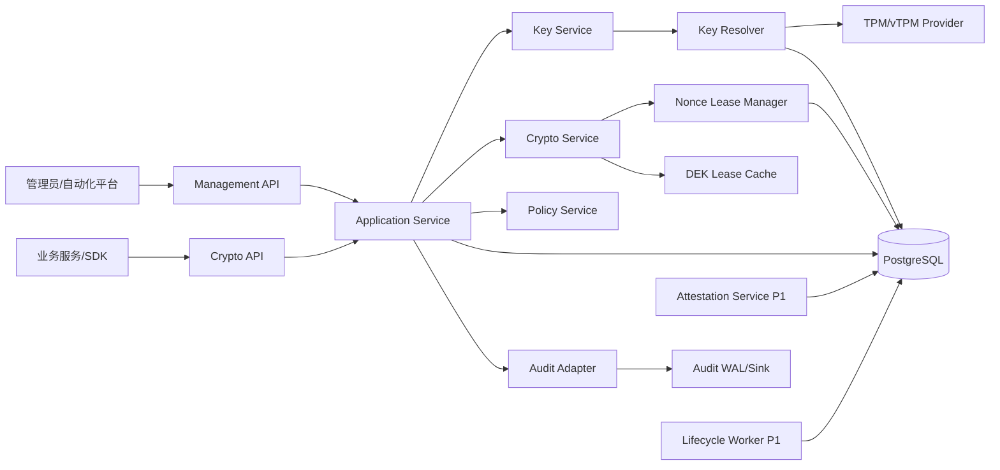

### 4.2 部署拓扑图

P0 可以采用单集群、单二进制多模块方式降低复杂度；P1 起建议按平面拆分 Deployment、ServiceAccount、NetworkPolicy 和数据库角色；P2/P3 再引入跨区域、外部 HSM/KMS 或独立审计域。

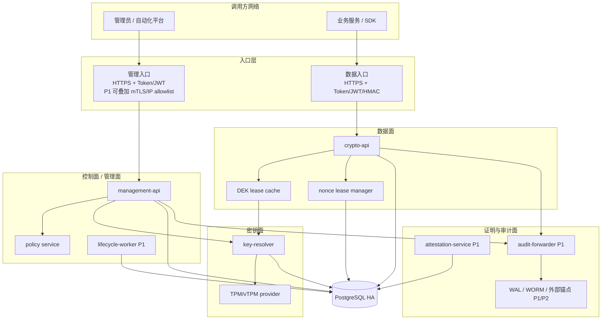

### 4.3 平面划分

| 平面 | P0 定位 | P1/P2 增强 | 不允许做的事 |
| --- | --- | --- | --- |
| 管理面 | 密钥创建、查询、启停、轮转、策略查询、基础审计 | 审批流、IP allowlist、MFA、mTLS、操作工单 | 返回 CRK/DEK 明文 |
| 密钥面 | CRK 解封、DEK 封装/解封、DEK lease 签发 | 远程证明绑定、Policy Session、CRK 轮转 | 对外暴露通用管理路由 |
| 数据面 | Encrypt/Decrypt/DataKey，高吞吐、短 TTL 缓存 | 独立部署池、租约熔断、灰度策略 | 持有 CRK、访问 TPM、执行管理操作 |
| 证明面 | P0 可仅保留节点注册和状态检查 | TPM Quote/Event Log 自动准入、周期复核、撤销 | 证明失败后仍签发 lease |
| 审计面 | 结构化审计事件、敏感字段脱敏 | WAL、哈希链、外部锚点、审计验证工具 | 记录敏感明文或完整密文包 |
| 运维恢复面 | 基础健康检查、备份说明 | Runbook as Code、隔离恢复演练、报告 | 与生产数据面混用恢复材料 |

### 4.4 部署单元

| 组件 | P0 是否实现 | 职责 | 隔离要求 |
| --- | --- | --- | --- |
| `management-api` | 是 | 管理 API、鉴权、授权、密钥生命周期入口 | 独立路由前缀；可与服务进程同部署但需逻辑隔离。 |
| `crypto-api` | 是 | Encrypt/Decrypt/DataKey | 不注册管理路由；不挂载 TPM；只持 DEK lease。 |
| `key-resolver` | 是 | CRK 短时解封、DEK 封装/解封、DEK lease | 仅内网访问；严格审计；可访问 TPM/vTPM。 |
| `attestation-service` | P1 | Quote/Event Log 校验、基线管理、节点准入 | 独立状态机；READY 结果写数据库。 |
| `lifecycle-worker` | P1 | 自动轮转、销毁、缓存失效、outbox 派发 | 无公网入口；任务幂等。 |
| `audit-forwarder` | P1 | WAL 回放、哈希链、外部锚点 | 独立凭证；外部 sink 故障可缓冲。 |
| `recovery-runner` | P2 | 隔离恢复演练、恢复报告 | 不连接生产入口；恢复材料短时使用。 |

P0 可以采用单二进制多模块部署，以降低部署复杂度；但代码层必须保持模块边界，避免后续拆分困难。

数据库角色拆分（P0 起强制，对应 HA-06）：

| DB 角色 | 权限范围 | 使用方 | 禁止权限 |
| --- | --- | --- | --- |
| `kv_app_rw` | `keys`、`key_versions`、`dek_leases`、`nonce_leases`、`outbox_events`、`idempotency_keys` 的最小 DML；`audit_events` 仅 INSERT | management-api、crypto-api | 任何 DDL、`crk_node_envelopes` 明文列直读、`audit_events` UPDATE/DELETE |
| `kv_resolver_rw` | `crk_node_envelopes`、`crk_versions` 的最小 DML；`dek_leases` 和 `audit_events` 仅所需 SELECT/INSERT | key-resolver 专用 | DDL、管理面状态表写、`audit_events` UPDATE/DELETE |
| `kv_worker_rw` | `lifecycle_jobs`、`outbox_events` 消费标记 | lifecycle-worker | DDL、密钥材料表写 |
| `kv_audit_w` | `audit_events` 只读；`audit_chain_heads` 仅 INSERT | audit-forwarder | UPDATE/DELETE、业务表写 |
| `kv_migrate` | 全部 DDL | 迁移工具独立凭证，仅在迁移窗口启用 | 常驻运行时禁用 |

约束：

- API 服务进程不得持有任何 DDL 权限，防止 SQL 注入升级为结构篡改。
- `crk_node_envelopes` 的明文封装列仅 `kv_resolver_rw` 可读，数据面 DB 角色不得授予该列读权限。
- 迁移凭证与运行时凭证分离，迁移完成后迁移凭证应禁用或回收。

### 4.5 控制面/数据面隔离策略

按阶段落地：

| 阶段 | 隔离方式 | 说明 |
| --- | --- | --- |
| P0 | 逻辑隔离 | 独立路由、独立中间件、独立 RBAC scope、数据面不注册管理 API。 |
| P1 | 部署隔离 | `management-api`、`crypto-api`、`key-resolver` 独立 Deployment、ServiceAccount 和数据库角色。 |
| P2 | 网络/物理强化 | 管理面独立域名、IP allowlist、WAF、mTLS、专用节点池或独立集群。 |

数据面节点只能加载 DEK lease cache，不暴露密钥管理接口。管理/密钥面节点才允许解封 CRK 和创建新 KeyVersion。数据面被攻陷时，攻击者最多影响短 TTL DEK lease 和其权限范围内的数据操作，不能触发密钥轮转、销毁或 CRK 操作。

错误响应边界（P0 起强制，对应 HA-11）：

- 跨租户的资源不存在与权限不足必须返回同一错误码（统一 `PERMISSION_DENIED` 或统一 `KEY_NOT_FOUND`，由全局策略选定），避免攻击者通过错误码差异枚举 `key_id`、`tenant_id` 是否存在。
- 错误响应不得携带租户内部命名、内部状态机细节、内部节点 ID 等可被枚举的元数据。
- 数据面与管理面对外错误模型一致，禁止数据面返回管理面专属错误细节。
- 响应时间差异需通过统一处理路径收敛，避免存在性探测基于时延侧信道。

### 4.6 模块依赖图

模块依赖必须保持单向：API 层调用应用服务，应用服务编排领域规则和仓储，仓储/TPM/加密/Auth/Audit 作为基础适配器。领域层不得反向依赖基础设施，避免后续拆分微服务或替换 Provider 时牵连业务规则。

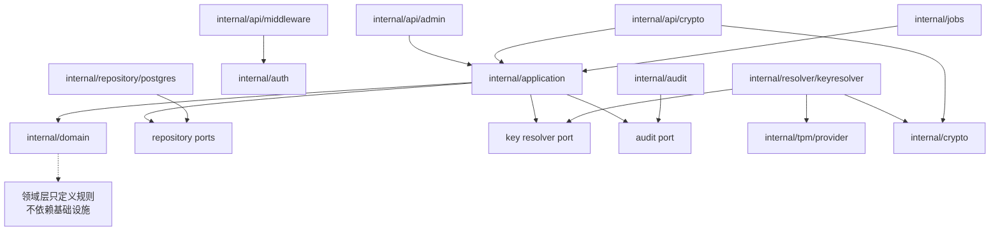

## 5. 认证与授权设计

### 5.1 P0 轻量认证方案

由于 mTLS 部署复杂度较高，P0 不强制 mTLS。推荐采用以下组合：

| 场景 | P0 推荐 | 说明 |
| --- | --- | --- |
| 管理员访问管理 API | HTTPS + OIDC/JWT 或短期管理 Token + IP allowlist | 高风险操作再叠加审批或二次确认。 |
| 业务服务访问数据 API | HTTPS + JWT/OIDC service token | token 绑定 `tenant_id`、`aud`、`scope`、过期时间。 |
| 服务间调用 key-resolver | 内网 HTTPS + HMAC 请求签名或短期 service JWT | 请求签名覆盖 method、path、body_hash、timestamp、nonce。 |
| 节点身份 | `node_id` + service token + 数据库节点状态 | P1 起由 Attestation Token 替代或叠加。 |

HMAC 请求签名格式建议：

```text
string_to_sign =
  method + "\n" +
  path + "\n" +
  sha256(body) + "\n" +
  timestamp + "\n" +
  nonce + "\n" +
  node_id

signature = base64url(HMAC-SHA256(service_secret, string_to_sign))
```

HMAC 签名覆盖要求（P0 起强制，对应 HA-02）：

- 签名必须覆盖 `method`、`path`、`sha256(body)`、`timestamp`、`nonce`、`node_id` 全部六项，缺一拒绝。
- `sha256(body)` 必须基于规范化后的请求体计算，禁止仅签名 URI 而忽略 body。
- `nonce` 必须在 `timestamp ± 300s` 窗口内按 `credential_id`（或不可变 `node_id`）唯一，存储窗口至少覆盖 2 倍时间偏差；不得以全局 nonce 命名空间造成跨调用方拒绝服务。
- 服务端必须先校验 `timestamp` 窗口和请求字段长度，再校验签名；签名通过后，才以原子「插入成功即占用」方式登记 `(credential_id, nonce)`。重复插入即拒绝。不得在验签前持久化 nonce，否则攻击者可抢占 nonce 阻断合法请求。
- GET 请求 body 为空时 `sha256(body)` 使用空字节串的哈希固定值。

服务端校验要求：

- `timestamp` 与服务端时间偏差默认不超过 300 秒。
- `nonce` 在窗口期内不可重复。
- `node_id` 必须处于 `READY` 或 P0 允许的 `REGISTERED` 状态。
- `aud` 必须匹配目标服务，禁止跨服务 token 复用。
- 禁止 JWT `alg=none`，固定算法白名单。

JWT 必校验字段（P0 起强制，对应 HA-01）：

- `iss`：必须匹配预配置 issuer 白名单。
- `aud`：必须匹配目标服务，禁止跨服务复用。
- `exp`：必须存在且未过期；高权限 scope token 默认 TTL ≤ 15 分钟。
- `nbf`：存在时必须生效。
- `kid`：必须存在并通过 JWK 缓存解析到具体公钥，禁止接受无 `kid` 的 token。
- `alg`：固定白名单（如 `RS256`、`ES256`），禁止 `none`、禁止算法协商降级。
- `sub`/`tenant_id`：必须存在并参与 ABAC 判定。
- `scope`：必须存在，高权限 scope（`keys:rotate`、`keys:destroy`、`nodes:manage`、`policies:manage`）必须独立签发，不得与数据面 scope 合并到同一 token。

OIDC Discovery 严格校验（P0 起强制）：

- 启用 OIDC 时，服务启动必须拉取并校验 issuer 的 Discovery 元数据文档（`.well-known/openid-configuration`），校验 `issuer`、`jwks_uri`、`id_token_signing_alg_values_supported` 等字段完整性，防止 issuer 配置漂移。
- `issuer` 必须与预配置白名单精确匹配（含 scheme、path、无尾斜杠规范化），禁止通过元数据动态发现新增 issuer。
- `jwks_uri` 必须与预配置一致或同源，禁止元数据中 `jwks_uri` 指向未授权外部域。
- Discovery 文档拉取失败时服务拒绝启动（fail-closed），不得回退到内嵌旧文档；运行期定期复核，漂移触发告警并停止接受新 token。
- 支持的签名算法白名单与 JWT `alg` 校验一致，元数据中出现的非白名单算法不参与协商。

### 5.2 P1/P2 认证增强

| 能力 | 引入阶段 | 触发条件 |
| --- | --- | --- |
| mTLS | P1/P2 | 管理面暴露到更大网络范围、租户隔离要求提高、服务间身份需强绑定。 |
| Workload Identity | P1 | Kubernetes 环境具备稳定 service account token 发行能力。 |
| TPM Attestation Token | P1 | 节点准入从人工/静态注册升级为自动证明。 |
| MFA/审批流 | P1/P2 | 导出、销毁、CRK 轮转、策略降级等高风险操作。 |
| Token Introspection / 实时撤销 | P1 | Token 泄露后需在 TTL 窗口内即时失效。 |
| Token Binding 到请求 IP/节点 | P1 | 防止 Token 横向迁移（P0 由 IP allowlist 缓解）。 |
| Proof-of-Possession (DPoP) | P2 | Token 重放风险需更强缓解（P0 已由 HMAC 缓解）。 |

Token 实时撤销与节点级失效（P1 起强制）：

P0 的 JWT/HMAC 方案在 Token 泄露后最长 TTL 窗口内仍有效，P1 必须补齐实时撤销能力：

- 在 `nodes` 表增加 `last_token_issued_at` 和 `token_fingerprint_hash` 字段，签发 service token 时记录指纹（非明文）。
- 节点撤销时同步失效该节点已签发的 service token（类似 Vault 的 `token_accessor` 机制），撤销操作通过 outbox 异步广播到所有校验节点。
- 高权限 scope token（`keys:rotate`、`keys:destroy`、`nodes:manage`、`policies:manage`）支持 Token Introspection：校验侧可向签发方实时查询 token 是否被撤销，TTL 仍作为兜底。
- DPoP（P2）在 mTLS 之外叠加请求级 PoP，绑定 token 到客户端持有的私钥，进一步降低重放风险；P0/P1 由 HMAC 请求签名 + nonce 防重放缓解。

### 5.3 授权模型

| scope | 能力 |
| --- | --- |
| `keys:create` | 创建数据密钥。 |
| `keys:read` | 查询密钥元数据。 |
| `keys:update` | 启用、停用、修改策略。 |
| `keys:rotate` | 创建新版本并切换当前版本。 |
| `keys:destroy` | 计划销毁或撤销密钥。 |
| `crypto:encrypt` | 加密。 |
| `crypto:decrypt` | 解密。 |
| `datakey:generate` | 生成 DataKey。 |
| `nodes:manage` | 节点注册、撤销、状态管理。 |
| `policies:manage` | 策略发布、灰度、禁用算法。 |
| `audit:read` | 查询审计事件或报告。 |

ABAC 约束：

- 租户必须以已认证主体中的不可变 `tenant_id`/workload identity 为准；客户端请求体中的 `tenant_id` 仅作一致性断言，缺失时由服务端注入，不一致时拒绝。禁止以请求体字段决定授权租户、限流租户或审计租户。
- `key_id` 必须属于当前租户或当前业务域。
- 管理 API 禁止由数据面 service token 调用。
- 高风险操作必须检查 `approval_id` 或二次确认状态。

DataKey 专项约束（P0 起强制，对应 HA-10）：

- `datakey:generate` 必须独立签发，不得与 `crypto:encrypt`/`crypto:decrypt` 合并到同一 scope 集合，降低 token 泄露后的明文密钥外泄面。
- DataKey 接口必须按租户配置 quota（默认每租户每分钟 N 次，可配置），超 quota 返回 `429`。
- DataKey 响应的时间字段仅表示 SDK 的本地零化截止时间（默认 5 分钟、最大 15 分钟），不是服务端可强制执行的密码学失效时间；字段应命名为 `client_zeroize_by`，并在 SDK 中强制到期拒用和零化。
- DataKey 接口必须记录独立审计事件，包含 `tenant_hash`、`key_id_hash`、`purpose`、`ttl`、`request_id`，不记录明文。
- 直接 API 调用 DataKey（非 SDK）必须标记 `caller=direct`，便于异常解密检测时优先审查。

### 5.4 认证授权链路图

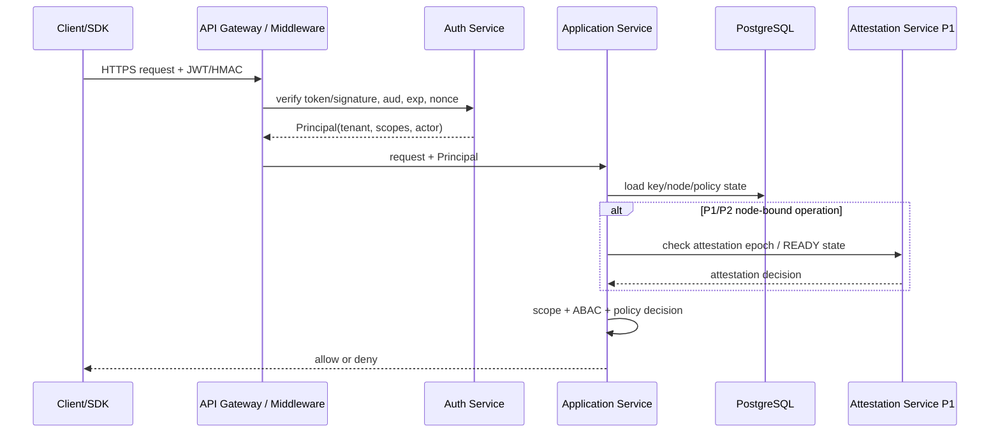

判定顺序必须固定：先做身份认证，再做租户和 scope 检查，再读取 Key/Node/Policy 状态，最后执行 ABAC 和高风险审批。禁止先执行业务动作再补审计或补授权。

## 6. 密钥体系与 TPM/vTPM 设计

### 6.1 密钥层级

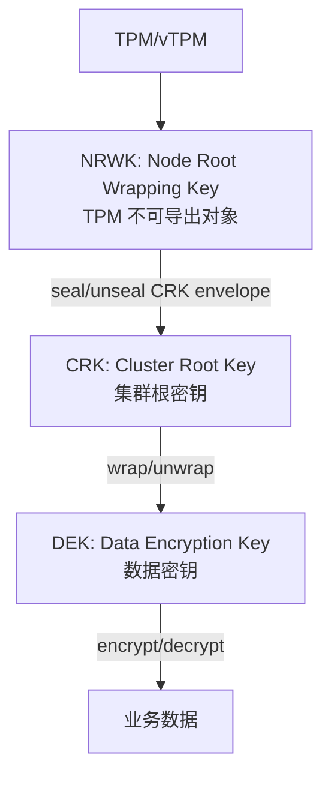

| 密钥 | 生成位置 | 存储形态 | 用途 |
| --- | --- | --- | --- |
| NRWK | TPM/vTPM 内部生成 | TPM 持久对象或可重建对象，私钥不可导出 | 保护 CRK envelope。 |
| CRK | 可信引导节点使用 CSPRNG 生成 | 被 NRWK/TPM 策略封装后保存 | 封装/解封 DEK。 |
| DEK | key-resolver 或管理用例生成 | 被 CRK 封装后写入数据库 | 加密业务数据或 DataKey 输出。 |
| DataKey 明文 | 受控接口短时返回 | 不入库，不落日志，短时内存存在 | 客户端信封加密或大对象分片加密。 |

### 6.2 NRWK

NRWK 建议属性：

- 由 TPM 创建，不可导出。
- 固定对象属性：`fixedTPM`、`fixedParent`、`sensitiveDataOrigin`、`userWithAuth`、`decrypt`。
- 绑定 PCR Policy 或 P1 起绑定 Attestation Baseline。
- 持久句柄由配置管理，避免冲突。

句柄规划示例：

| 句柄 | 用途 |
| --- | --- |
| `0x81010010` | 当前 NRWK。 |
| `0x81010011` - `0x8101001F` | NRWK 滚动预留窗口。 |
| `0x81010100` | Attestation Key 或其引用。 |

### 6.3 CRK

CRK 设计要求：

- 使用 `crypto/rand` 生成 256 bit 或 512 bit 随机材料，按策略派生 KEK。
- CRK 明文只存在于 key-resolver 的受控临界区。
- 解封后立即用于 DEK wrap/unwrap，使用后零化。
- 不长期缓存 CRK；高频场景通过短 TTL DEK lease 降低 TPM 压力。
- CRK envelope AAD 必须绑定 `cluster_id`、`node_id`、`plane_role`、`crk_version`、`nrwk_name`、`baseline_digest`、`policy_digest`。

P1 安全增强：

- TPM Policy Session + AuthValue 动态绑定。
- PolicyAuthorize 或 PolicySecret 控制恢复/轮转。
- CRK 分片恢复，恢复材料只在隔离环境短时重组。
- 分片恢复与 singleflight 协同：分片恢复路径绕过 singleflight 合并，但必须经过双人审批门禁、独立审计事件和速率限制，避免分片恢复被滥用绕过解封并发上限。
- Go 内存保护可评估 `memguard` 或等价机制，但不得把它当作对内核级攻击的完整防护。

P0 `cluster_epoch` 篡改感知：

- `cluster_epoch` 变更必须写入独立审计事件 `cluster_epoch.changed`，包含 `old_epoch`、`new_epoch`、`trigger`（`crk_reseal`/`node_ready`/`manual`）、`operator`，事件落本地 WAL 骨架。
- 节点 READY 时校验 `cluster_epoch` 与本地缓存的最近一次 epoch 一致，偏差超阈值触发告警并拒绝解封。
- P1 起将 `cluster_epoch` 变更事件纳入哈希链和外部锚点，防止 DBA 权限被滥用绕过 vTPM 回滚检测。

### 6.4 DEK

DEK 管理规则：

- 每个 KeyVersion 对应一个 DEK。
- DEK 入库只保存 `wrapped_dek`。
- 创建密钥、轮转密钥时生成新 DEK。
- 停用密钥后拒绝新加密，保留旧版本解密窗口。
- 销毁进入延迟销毁状态，过冷静期后删除或不可恢复地擦除 wrapped DEK。

### 6.5 防回滚

P0：

- 通过数据库版本号、状态机和事务锁防止普通并发回滚。
- `key_version.version_no` 单调递增。
- CRK 版本和策略版本必须随审计记录保留。
- 引入 `cluster_epoch` 字段骨架（对应 HA-08）：在 `crk_versions` 表预留 `epoch` 列，P0 由数据库单调递增维护（每次 CRK envelope 重新封装或节点 READY 状态变更时 +1），P1 起由 TPM NV counter 或等价平台机制背书。P0 的 `epoch` 不提供硬件级防回滚，但为 P1/P2 升级提供数据骨架和审计锚点。
- `nodes` 表预留 `attestation_epoch` 列，P0 写入静态注册时的 `cluster_epoch` 快照，P1 起由 Attestation Service 写入证明纪元。

P1/P2：

- 使用 TPM NV counter 或等价平台机制记录 `epoch`，覆盖 P0 数据库 `epoch`，并校验数据库 `epoch` 不低于 NV counter。
- 节点证明结果绑定 `attestation_epoch`，证明过期或回滚时 `attestation_epoch` 与 `cluster_epoch` 偏差超阈值即撤销 lease。
- 恢复演练验证数据库快照、CRK envelope、epoch 和审计链一致。
- vTPM 快照回滚检测：CRK envelope 解封时校验 `cluster_epoch` 与节点当前 `attestation_epoch` 一致，旧 epoch 拒绝解封。

### 6.6 宿主机安全基线检查

vTPM 信任边界依赖宿主机和虚拟化平台，P0 阶段虽不实施完整远程证明，但必须具备基础环境健康度感知能力，作为 Attestation Service 的前置补充。

P0 基线检查项（节点代理上报，管理面校验）：

- SELinux/AppArmor 状态：必须为 `enforcing` 或等价强制访问控制状态。
- 内核版本：必须在已知安全版本白名单内，禁止使用已知漏洞版本。
- 虚拟化平台版本：libvirt/QEMU/swtpm 版本必须在受支持版本范围内。
- TPM2-TSS 库版本：必须符合受支持版本范围，避免已知漏洞影响 NRWK 安全。
- swtpm 进程隔离：swtpm 必须运行在独立用户/容器命名空间，不与 key-resolver 同进程。
- 基线不符的节点拒绝进入 READY 状态，已 READY 节点基线漂移触发告警并撤销 lease。

P1 升级：

- 基线检查纳入 Attestation Service 自动化流程，结合 PCR 值和 Event Log 形成完整远程证明。
- 基线数据由 Attestation Service 集中管理，支持灰度更新和回滚。

## 7. 业务优先需求拆分

### 7.1 P0 业务功能

| 编号 | 功能 | 描述 | 备注 |
| --- | --- | --- | --- |
| BF-01 | 创建密钥 | 按租户、用途、算法策略创建 Key 和 KeyVersion。 | 不返回 DEK 明文。 |
| BF-02 | 查询密钥 | 查询 Key、版本、状态、策略、创建时间。 | 不返回 wrapped_dek。 |
| BF-03 | 启用/停用密钥 | 控制新加密能力和解密能力。 | 状态变更写审计。 |
| BF-04 | 轮转密钥 | 创建新 KeyVersion 并原子切换 current version。 | 旧版本进入仅解密。 |
| BF-05 | 小对象加密 | 服务端完成加密并返回 Envelope。 | 默认 AES-256-GCM。 |
| BF-06 | 小对象解密 | 解析 Envelope，按版本解密。 | 校验 AAD、状态、权限。 |
| BF-07 | DataKey | 生成明文 DataKey 和 wrapped DataKey。 | SDK 内部使用优先。 |
| BF-08 | 轻量认证授权 | JWT/HMAC/Token、scope、租户隔离。 | mTLS 后续增强。 |
| BF-09 | 基础审计 | 结构化审计、敏感字段脱敏。 | P1 增强 WAL/哈希链。 |
| BF-10 | 基础生命周期任务 | 轮转、销毁、缓存失效的可重试任务。 | P0 可手动触发。 |

### 7.2 P1/P2 运维与审计功能

| 编号 | 功能 | 阶段 | 说明 |
| --- | --- | --- | --- |
| OF-01 | 自动化远程证明 | P1 | TPM Quote、Event Log、PCR、基线自动校验。 |
| OF-02 | 审计 WAL 与哈希链 | P1 | 高风险同步 WAL，事件链式哈希。 |
| OF-03 | 外部审计锚点 | P1/P2 | 链头发布到 WORM、对象锁定存储或透明日志。 |
| OF-04 | Recovery Runbook as Code | P1/P2 | 隔离恢复演练、报告输出。 |
| OF-05 | 审批流 | P1 | 节点注册、导出、销毁、CRK 轮转双人审批。 |
| OF-06 | 策略热更新和灰度 | P1 | 签名策略包、灰度算法迁移。 |
| OF-07 | 官方 SDK | P1/P2 | Go SDK 优先，后续 Java/Python。 |
| OF-08 | 容量与 SLO 治理 | P1 | p95/p99、TPM 压力、nonce 耗尽、审计积压。 |

### 7.3 P0-P3 分阶段功能全景

功能阶段不按“技术炫技程度”划分，而按业务可用性、风险收敛和生产成熟度划分。P0 解决最小业务闭环，P1 解决生产可管可审，P2 解决规模化和高保障，P3 解决生态化、合规化和平台化。

| 阶段 | 阶段目标 | 服务对象 | 核心判断 |
| --- | --- | --- | --- |
| P0：业务 MVP | 让业务可以安全完成密钥创建、加密、解密、轮转和 DataKey 使用。 | 内部可信业务、试点租户。 | 能否在受控环境跑通端到端业务闭环，并守住 CRK/DEK/nonce 安全底线。 |
| P1：生产基础版 | 让系统具备生产可运维、可审计、可证明、可恢复的基础能力。 | 内部多业务租户、生产集群。 | 能否在多节点、故障、审计、撤销和策略变化下稳定运行；共享集群 CRK 仅适用于同一风险域。 |
| P2：高保障增强版 | 对齐云 KMS、Vault Enterprise、HSM/KMS 类成熟治理能力。 | 高安全租户、合规业务、跨集群部署。 | 能否满足强身份、强审计、灾备演练、算法迁移和容量治理要求。 |
| P3：平台生态版 | 形成标准化 KMS 平台、SDK 生态和跨环境兼容能力。 | 企业平台团队、外部系统、跨语言应用。 | 能否作为组织级密钥服务长期演进，支持多区域、多语言、多合规基线。 |

### 7.4 P0 功能详细设计

P0 的目标是“业务可用但安全边界不松”。运维、审计和证明能力可以先做轻量版本，但密钥保护、鉴权、nonce、日志脱敏不能延期。

| 域 | 功能 | 详细设计 | 验收要求 |
| --- | --- | --- | --- |
| 密钥管理 | 创建密钥 | `POST /v1/keys` 创建 Key 和初始 KeyVersion；DEK 由服务端生成并用 CRK 封装；返回元数据。 | 数据库无明文 DEK；重复幂等键返回同一结果。 |
| 密钥管理 | 查询密钥 | 支持按 `tenant_id`、`key_id`、状态、标签查询；不返回 `wrapped_dek`。 | 越权租户查询失败；分页稳定。 |
| 密钥管理 | 启用/停用 | `ACTIVE`、`DISABLED` 状态切换；停用后拒绝新加密。 | 停用后旧密文解密策略明确。 |
| 密钥管理 | 轮转 | 创建新 KeyVersion，原子切换 `current_version`，旧版本 `DECRYPT_ONLY`。 | 并发轮转只有一个成功；旧密文可解密。 |
| 密钥管理 | 计划销毁 | P0 可实现 `DESTROY_PENDING` 状态和冷静期，不强制物理擦除。 | 销毁中禁止新加密；可查询销毁时间。 |
| 数据加密 | 小对象加密 | 服务端 Encrypt，默认 `AES_256_GCM`，支持 `SM4_GCM`。 | AAD 绑定租户、Key、版本、用途。 |
| 数据加密 | 小对象解密 | 解析 Envelope，按 KeyVersion 解密。 | 错 AAD、错租户、错版本全部失败。 |
| DataKey | 生成 DataKey | 返回明文 DataKey 和 wrapped DataKey，供 SDK 或业务客户端信封加密。 | 明文 DataKey 不入库、不入日志；TTL 必填。 |
| 认证授权 | 轻量认证 | HTTPS + JWT/OIDC 或 HMAC 请求签名；管理/数据 scope 分离。 | 过期、错 aud、错 scope、重放请求拒绝。 |
| 审计 | 基础审计 | 记录关键操作结构化事件，敏感字段脱敏。 | 日志扫描无 token、明文、DEK、CRK。 |
| 可观测 | 基础指标 | 请求量、错误率、延迟、缓存命中率、nonce 使用率。 | 指标可被 Prometheus 或等价系统采集。 |
| 部署 | 单集群多副本 | 支持多副本 API，PostgreSQL 共享状态。 | 任一 API 副本重启不影响数据一致性。 |

P0 明确不做或只做骨架：

- 不强制 mTLS。
- 不做完整远程证明自动准入，只保留节点注册和状态字段。
- 不做审计哈希链外部锚点。
- 不做 CRK 自动轮转。
- 不做跨语言 SDK，只优先 Go SDK 或最小 HTTP 示例。
- 不做复杂审批流，只保留审批字段和接口扩展点。

### 7.5 P1 功能详细设计

P1 的目标是进入生产基础版：多节点可治理，关键操作可审计，节点可信状态可验证，生命周期任务可自动化。

| 域 | 功能 | 详细设计 | 验收要求 |
| --- | --- | --- | --- |
| 证明准入 | Attestation Service | 节点启动提交 TPM Quote、Event Log、nonce；服务校验 PCR、固件、OS baseline。 | 未通过证明的节点不得 READY。 |
| 证明准入 | 周期复核 | READY 节点定期重新证明；失败进入 `DEGRADED` 或 `REVOKED`。 | 证明过期后不得签发新 DEK lease。 |
| 密钥面 | CRK node envelope | 只为 READY 的管理/密钥面节点生成 CRK envelope。 | 数据面节点无 CRK envelope。 |
| 生命周期 | lifecycle-worker | 处理轮转、销毁、缓存失效、重试、补偿任务。 | 任务幂等，崩溃后可续跑。 |
| 生命周期 | Cryptoperiod 到期检测 | lifecycle-worker 扫描超期 ACTIVE KeyVersion，自动发轮转告警和工单。 | 超期版本不自动轮转，人工确认后执行。 |
| 审计 | WAL | 高风险操作先写审计 WAL，再提交业务成功。 | WAL 不可用时高风险操作 fail-closed。 |
| 审计 | 哈希链 | 审计事件包含 `prev_hash`、`current_hash`、`sequence`。 | 删除、截断、重排可检测。 |
| 策略 | 签名策略包 | Crypto Policy 使用签名包发布，服务端验签后加载。 | 未签名或签名错误策略拒绝。 |
| 认证 | mTLS 可选增强 | 管理面、key-resolver 内部调用可启用 mTLS。 | 可按环境开关，不破坏 P0 token 模式。 |
| 运维 | 节点撤销 | 撤销节点后清理 DEK lease、nonce lease、CRK envelope。 | 被撤销节点请求立即失败。 |
| SDK | Go SDK 完整版 | 封装认证、Envelope、AAD、DataKey、重试、错误模型。 | SDK 通过端到端和负向测试。 |
| 恢复 | 基础恢复演练 | 在隔离环境恢复 DB、CRK envelope、策略，验证测试 DEK。 | 输出恢复报告。 |

P1 的设计重点是“支撑系统持续运行”，因此必须把 outbox、worker、审计 WAL、证明状态与缓存失效打通。

Cryptoperiod 工单化（P1 起强制）：

- 在 `lifecycle_jobs` 中增加 `key_expiry_check` 任务类型，定期扫描 `key_versions` 中超过 `cryptoperiod` 的 ACTIVE 版本。
- 命中超期版本后自动触发轮转工单：发通知 + 写工单记录，不自动执行轮转，避免未预期中断业务。
- 工单进入待审批队列，人工确认后由 lifecycle-worker 执行轮转（复用 9.6 轮转流程）。
- `cryptoperiod` 由策略定义，按 `suite_id` 和密钥用途区分；超期未处理的工单升级告警，避免长期搁置。
- 该机制补齐 NIST SP 800-57 对密码期自动执行的要求，P0 仅有字段无自动触发，P1 起闭环。

### 7.6 P2 功能详细设计

P2 对齐成熟 KMS/HSM/Vault 类生产实践，强化高保障、多租户、灾备和算法敏捷性。

| 域 | 功能 | 详细设计 | 验收要求 |
| --- | --- | --- | --- |
| 高保障身份 | 强 mTLS / Workload Identity | 管理面和服务间通信默认 mTLS；Kubernetes 场景绑定 ServiceAccount。 | 证书轮换不中断服务；错证书拒绝。 |
| 密钥治理 | CRK 轮转 | 生成新 CRK，批量重封装 DEK，双人审批，冷静期保留旧 CRK。 | 切换失败可回滚；旧密文可解密。 |
| 密钥治理 | wrapped key 导入/导出 | 只允许密文包导入导出，强审批和同步审计。 | 不存在明文导出路径。 |
| 审计 | 外部锚点 | 定期将审计链头发布到 WORM、对象锁定存储或透明日志。 | 可从外部锚点验证链完整性。 |
| 灾备 | Recovery Runbook as Code | 自动拉起隔离环境，恢复快照，验证 epoch、DEK、审计链。 | 季度演练自动出报告，人工签字。 |
| 性能 | 容量治理 | 对 DEK lease、nonce、TPM 解封、数据库锁、审计积压做容量水位控制。 | 达到 SLO，压力测试报告可复现。 |
| 策略 | 灰度与算法迁移 | 按租户、Key、节点池灰度新策略；旧算法进入 decrypt-only。 | 无需发版即可禁用 CBC/ECB 新加密。 |
| 多租户 | 租户隔离增强 | 独立 quota、速率限制、策略、审计链和资源视图。 | 单租户异常不拖垮全局服务。 |
| 多租户 | 独立 CRK 租户选项 | `tenants.crk_version_id` 绑定专属 CRK，高保障租户 DEK 由专属 CRK 封装。 | 单租户 CRK 泄露不影响其他租户 DEK。 |
| SDK | 流式加密 | 官方 SDK 支持大对象分块认证加密。 | 分块篡改可检测，内存占用受控。 |
| 供应链 | 构建与依赖治理 | SBOM、依赖漏洞扫描、镜像签名、最小权限镜像。 | 上线安全评审通过。 |

### 7.7 P3 功能详细设计

P3 是平台生态和长期演进阶段，目标是把系统从“项目级 KMS”提升为“组织级密码服务平台”。

| 域 | 功能 | 详细设计 | 验收要求 |
| --- | --- | --- | --- |
| 多区域 | 跨区域部署 | 多区域只复制 wrapped key、策略、审计元数据；CRK 按区域独立或受控共享。 | 区域故障时满足 RTO/RPO。 |
| 多云/混合云 | 外部 KMS/HSM 接入 | 抽象 RootKeyProvider，支持 TPM、HSM、云 KMS、TEE。 | Provider 可替换，不影响上层 API。 |
| 生态 | 多语言 SDK | Go、Java、Python、Rust/Node 按业务优先级提供。 | Envelope 兼容测试向量跨语言通过。 |
| 合规 | 密码模块合规 | 对接国密、等保、密评、FIPS 或内部密码基线要求。 | 合规矩阵和证据包完整。 |
| 自服务 | 租户门户 | 租户自助查看 Key、策略、审计、用量、告警。 | 操作受 RBAC/ABAC 控制。 |
| 智能治理 | 风险检测 | 异常解密、nonce 激增、失败率、跨租户探测、策略降级告警。 | 告警可定位到租户、Key、节点和请求。 |
| 数据治理 | 重加密框架 | 支持业务数据批量重加密任务编排和进度回写。 | 可暂停、恢复、限速、审计。 |
| 标准化 | OpenAPI/Conformance | 发布 OpenAPI、SDK 一致性测试、兼容性承诺。 | 任一 SDK 升级需通过 conformance suite。 |

### 7.8 P0-P3 能力依赖关系

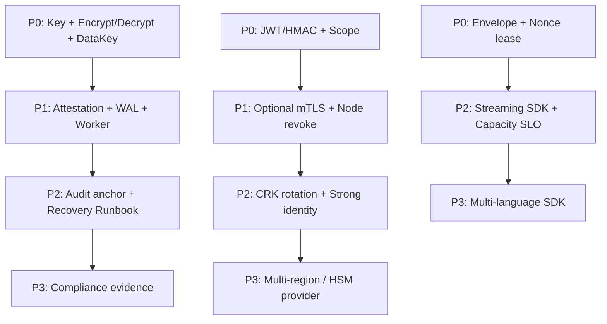

阶段推进门槛：

- P0 未通过 nonce、敏感日志、CRK/DEK 不变量测试，不得进入生产试点。
- P1 未通过审计 WAL、节点撤销、worker 幂等测试，不得承载多业务生产。
- P2 未通过恢复演练、CRK 轮转、容量压测，不得承载高保障和合规业务。
- P3 必须建立兼容性承诺和 conformance suite，否则 SDK 和多区域能力会拖累主系统稳定性。

## 8. 数据加解密设计

### 8.1 算法策略

| 算法套件 | 阶段 | 用途 | 说明 |
| --- | --- | --- | --- |
| `AES_256_GCM` | P0 | 默认加密套件 | AEAD，推荐默认。 |
| `SM4_GCM` | P0/P1 | 国密场景 | 需选用成熟实现并做 KAT。 |
| `AES_256_CBC_HMAC_SHA256` | P1 | 兼容模式 | Encrypt-then-MAC，不允许裸 CBC。 |
| `SM4_CBC_HMAC_SM3` | P1 | 国密兼容模式 | EtM，需策略显式允许。 |
| `AES_ECB` / `SM4_ECB` | 仅兼容解密 | 历史兼容 | 默认禁用新加密，需审批开启。 |

签名与哈希算法（P1 起支持，对接等保/密评）：

| 算法 | 阶段 | 用途 | 说明 |
| --- | --- | --- | --- |
| `SHA-256` | P0 | AAD hash、HMAC 请求签名、审计哈希链 | 默认哈希算法。 |
| `SM3` | P1 | AAD hash、HMAC 请求签名、审计哈希链 | 国密替代路径，与 SHA-256 平行注册，由 suite 配置选择。 |
| `RS256` / `ES256` | P0 | JWT、策略签名包 | 默认签名算法。 |
| `SM2` | P1 | 策略签名包、JWT 签名 | 国密非对称签名，对接 GM/T 0054 等保密评要求。 |

策略原则：

- 新加密默认只允许 GCM。
- CBC 必须配合独立 MAC，禁止无认证 CBC。
- ECB 不允许新加密，只能在兼容迁移期做有限解密。
- 密文 Envelope 必须记录 `suite_id`、`mode`、`key_version`、`policy_version`。
- 策略变更应支持旧密文解密，新密文使用新策略。

国密合规对齐（P1 起）：

- SM4-GCM 已在 P0 支持，符合 GM/T 0002 要求；SM2/SM3 在 P1 接入，补齐 GB/T 39786-2021 三级以上系统对非对称签名和哈希的国密算法要求。
- SM3 作为 SHA-256 的平行替代路径，覆盖审计哈希链（`prev_hash || current_hash`）、AAD hash、HMAC 请求签名，不推翻 SHA-256 路径，仅在 `suite_registry` 中平行注册并由策略选择。
- SM2 用于策略签名包签名与 JWT 签名，与 RS256/ES256 并存，由 issuer/策略发布方配置选择。
- TPM DRBG 是否通过国密认证需在 P1 评估并明确记录；未通过国密认证时，国密场景的随机数来源需补充合规路径。
- SM2/SM9 密钥协商、GM/T 0028 密码模块检测列入 P3 合规证据包，不在 P1 强制。

### 8.2 GCM Nonce

Nonce 格式建议：

```text
nonce = domain(32 bit) || counter(64 bit)
```

| 字段 | 来源 | 说明 |
| --- | --- | --- |
| `domain` | KeyVersion、节点租约分配与 `cluster_epoch` 派生 | 避免不同节点/版本冲突，并使 epoch 变更后历史 domain 天然失效。 |
| `counter` | 数据库租约区间 | 单调递增，先持久化后使用。 |

domain 派生与 epoch 绑定（P0 起强制）：

- `domain` 必须由 `key_version_id`、`cluster_epoch`、`node_id` 共同派生，使 domain 与 epoch 强绑定，避免 vTPM 快照回滚后旧 domain 的 counter 区间被不同节点复用。

```text
nonce_domain = truncate32(SHA256(key_version_id || cluster_epoch || node_id))
```

- epoch 变更后历史 domain 的 counter 区间天然失效，无需额外的显式回收逻辑。
- `cluster_epoch` 取自节点 READY 时写入的快照（见 6.5），与 `nodes.cluster_epoch` 一致；epoch 不一致时拒绝解封和分配新区间。

租约机制：

1. 数据面启动后为指定 `key_version_id` 申请 nonce 区间。
2. 数据库事务分配 `[start, end)`，并记录 `node_id`、`lease_id`、`expires_at`。
3. 本地使用计数器生成 nonce。
4. 使用达到 70% 水位时异步预取新区间。
5. 使用达到 90% 且预取失败时进入保护模式，限制新加密。
6. 区间耗尽仍未续租时拒绝新加密，避免 nonce 复用。

监控与熔断：

- nonce 消耗速率突增触发告警。
- 单节点异常消耗可冻结其新加密能力。
- 无论节点是否优雅退出，已分配的 nonce 区间均必须永久作废（burn），不得释放、回收或重新分配。进程崩溃、计数器回写滞后和并发请求会使「未使用」无法被可靠证明；以可用性换取 AEAD nonce 唯一性是不可接受的。
- TTL 或心跳超时仅用于回收租约记录、容量统计和阻止该节点继续使用，绝不能使对应计数区间重新可分配。

nonce 速率治理与节点冻结（P0 起强制，对应 HA-04）：

- 每个 `key_version_id × node_id` 维护滚动窗口 nonce 消耗速率基线（默认 1 分钟窗口），偏离基线 3 倍标准差或绝对阈值（可配置）即告警。
- 速率异常节点进入 `FROZEN` 状态：该节点的新 nonce 区间分配被拒绝，已分配未耗尽区间允许继续使用至耗尽或 TTL 到期，避免在途请求失败。
- `FROZEN` 节点必须经管理 API 显式解冻（`nodes:manage` scope）并记录审计，禁止自动解冻。
- 70% 水位预取失败时进入 `DEGRADED` 模式：限制新加密并发，触发告警；90% 水位仍未续租则 fail-closed 拒绝新加密。
- nonce 区间耗尽且无新区间可用时，对应 `key_version` 在该节点的新加密全部 fail-closed，旧密文解密不受影响。
- 单飞保护：同一 `key_version_id` 的 nonce 续租请求在 resolver 侧合并，避免 cache miss 风暴放大 TPM 压力。

nonce lease 分配-使用关联监控（P0 起强制）：

- 分配未使用率监控：统计每个 `node_id × key_version_id` 的 nonce 区间分配量与实际加密使用量，分配未使用率持续高于阈值（默认 50%）触发告警，可能暗示实现缺陷或异常调用模式。
- 分配-使用偏差监控：分配量与实际加密量在滚动窗口内偏差超过 3 倍标准差时告警，识别恶意消耗或客户端异常。
- 区间终结异常监控：非优雅退出节点的租约终结/作废记录延迟超阈值、或任一已分配区间被尝试重分配时立即告警。区间只能作废，不能回收复用。
- 关联事件纳入 HA-04 异常检测范围，与 nonce 速率治理共用 `FROZEN` 熔断机制。

### 8.3 Envelope v1

Envelope 二进制结构：

| 字段 | 类型 | 说明 |
| --- | --- | --- |
| `magic` | 4 bytes | 固定标识，如 `KVLT`。 |
| `version` | uint8 | Envelope 版本，当前为 1。 |
| `flags` | uint16 | 压缩、外部 AAD 等标志。 |
| `suite_id` | uint16 | 算法套件。 |
| `key_id_len` | uint16 | Key ID 长度。 |
| `key_version` | uint32 | 密钥版本号。 |
| `policy_version` | uint32 | 产生该密文时的策略版本。 |
| `nonce_len` | uint8 | nonce 长度。 |
| `tag_len` | uint8 | AEAD tag 或 MAC 长度，必须与 suite 的固定定义一致。 |
| `ciphertext_len` | uint64 | 密文长度；用于无歧义边界检查和拒绝超限输入。 |
| `aad_hash` | 32 bytes | 规范化 AAD 的 SHA-256。 |
| `key_id` | bytes | UTF-8 或 UUID bytes。 |
| `nonce` | bytes | GCM nonce 或 CBC IV。 |
| `ciphertext` | bytes | 密文。 |
| `tag` | bytes | AEAD tag 或 MAC。 |

AAD 规范化与认证：

- P0 固定使用一种规范化编码（推荐确定性 TLV）；不得让 SDK 或调用方在 JSON canonicalization 与 TLV 之间自行选择。编码必须具有明确的字段编号、UTF-8/字节串规则、最大长度和重复字段拒绝规则，并固化为测试向量。
- AEAD 的实际 AAD 必须是 `"kvlt-envelope-v1" || canonical(protected_header) || canonical(caller_aad)`。`protected_header` 至少包含 magic、version、flags、suite_id、key_id、key_version、policy_version、nonce 和所有长度字段；派生字段 `aad_hash` 不纳入自身的 AAD 编码，但必须等于 `hash(canonical(caller_aad))`。不得仅认证 `aad_hash`，否则 Envelope 头部可被篡改或产生解析歧义。
- `caller_aad` 必须包含 `tenant_id`、`key_id`、`key_version`、`purpose`、`suite_id`；可选包含业务上下文如 `resource_id`。`request_id` 不应作为默认 AAD 字段，以免业务重试或异步读取时不可解密。
- `aad_hash` 仅用作快速一致性检查和诊断索引；解密必须重建完整 AAD 并依赖 AEAD/MAC 验证，不得把哈希比较当作认证替代。

Envelope 解析安全（P0 起强制）：

解析外部输入的 Envelope 是攻击面，必须做严格长度检查，避免 parse 恐慌和越界读：

- 解析前先校验 v1 固定头部最小长度（含 `policy_version`、`tag_len`、`ciphertext_len` 与 `aad_hash`），不足直接返回 `ErrEnvelopeInvalid`。
- `magic` 不匹配直接拒绝，不进入后续解析。
- 所有 length 字段（`key_id_len`、`nonce_len`、`tag_len`、`ciphertext_len`）必须校验 suite 对应的固定值及全局上界；使用溢出安全的加法检查总长度，超过 `maxKeyIDLen`、`maxNonceLen`、`maxCiphertextLen` 或产生尾随字节时拒绝。
- 每次按 length 字段切片前必须校验剩余字节是否足够，不足则拒绝。
- 解析失败一律返回统一 `ErrEnvelopeInvalid`，不区分具体阶段，避免侧信道泄露格式细节。
- Envelope 完整解析路径必须通过模糊测试覆盖（见 19.4）。

后量子密码（PQC）预留（P3 起规划，P0 预留插槽）：

NIST 已于 2024 年 8 月标准化 ML-KEM、ML-DSA、SLH-DSA。为支持 5-10 年长期演进，Envelope v1 在 P0 即预留 PQC 扩展插槽，不在 P0/P1 实现：

- `flags` 字段预留一个 bit 标识 PQC 模式（如 `flag_pqc_kem`），P0 固定为 0；v1 实现必须拒绝未知或保留 flag，不能静默忽略安全语义未知的扩展。
- `suite_id` 空间预留复合套件 ID，如 `ML_KEM_768_AES_256_GCM`（ML-KEM 封装 DEK + AES-256-GCM 加密数据），用于 P3 替换 RSA-OAEP 的密钥传输场景。
- 预留插槽不改变 P0 Envelope v1 二进制布局，仅占用 `flags`/`suite_id` 编码空间，确保前向兼容。

### 8.4 指令集加速

Go 实现建议：

- AES：优先使用 Go 标准库 `crypto/aes` 和 `cipher.NewGCM`，运行时自动利用平台 AES 加速。
- SM4：封装为 `BlockCipherProvider` 接口，选择成熟库并做 KAT、基准测试和安全审查。
- GCM：优先使用标准库 AEAD 或经过验证的实现。
- CBC/EtM：自行编排模式可以接受，但底层分组算法和 MAC 必须来自成熟库。
- 禁止自研基础密码算法。

## 9. 关键业务技术流程

### 9.1 节点启动与准入流程

P0 使用轻量节点注册和 service token；P1 升级为自动化远程证明。

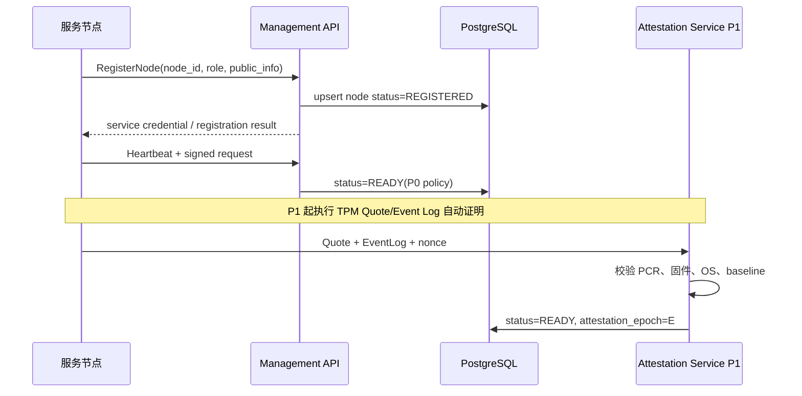

准入规则：

- P0：节点必须注册、token 有效、角色匹配、未撤销。
- P1：节点必须通过 Attestation Service 自动验证。
- 管理/密钥面节点 READY 后才可获得 CRK node envelope。
- 数据面节点 READY 后只能获得 DEK lease。

P0 宿主机安全基线前置检查（详见 6.6）：

- 节点注册时必须上报宿主机安全基线（SELinux/AppArmor 状态、内核版本、虚拟化平台版本、TPM2-TSS 库版本、swtpm 进程隔离状态）。
- 管理面校验基线符合白名单，基线不符的节点拒绝进入 READY 状态。
- 节点 READY 后定期上报基线快照，基线漂移触发告警并撤销 lease。
- 此检查作为 Attestation Service 的前置补充，P0 不依赖完整远程证明即可具备基础环境健康度感知。

### 9.2 系统引导与 CRK 初始化流程

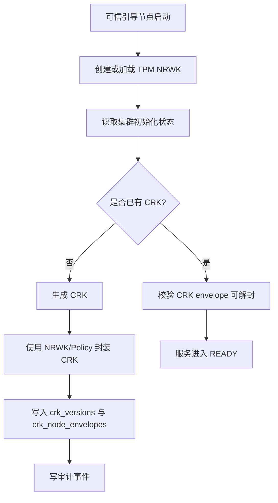

关键约束：

- 引导只允许在初始化窗口执行。
- 初始化操作必须幂等，重复执行不得生成多个当前 CRK。
- 初始化必须是受控的 bootstrap ceremony：使用数据库 advisory lock/可串行化事务取得唯一初始化权；初始化记录必须包含 `cluster_id`、初始 CRK 版本、目标管理节点的 NRWK Name、操作者和时间，并写入高风险 WAL。多副本部署不得依据“当前未读到 CRK”自行生成根密钥。
- 在生产或多管理员环境，首次初始化、为新节点签发 CRK envelope、以及恢复路径必须经过独立审批/带外节点注册校验；仅凭可在线申请的 service token 不得获得 CRK envelope。
- CRK envelope 绑定节点、角色、策略和 NRWK Name。
- 数据面节点不参与 CRK 初始化。

### 9.3 创建密钥流程

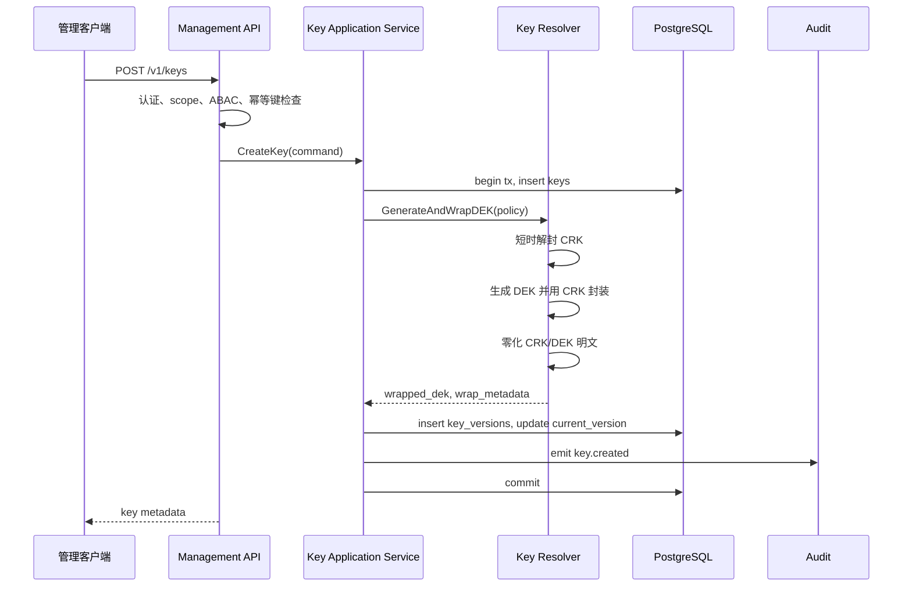

失败处理：

- 幂等键重复时返回原结果。
- CRK 解封失败则事务回滚。
- 审计失败：P0 普通审计可降级为本地缓冲；高风险操作 P1 起同步失败关闭。

### 9.4 小对象加密流程

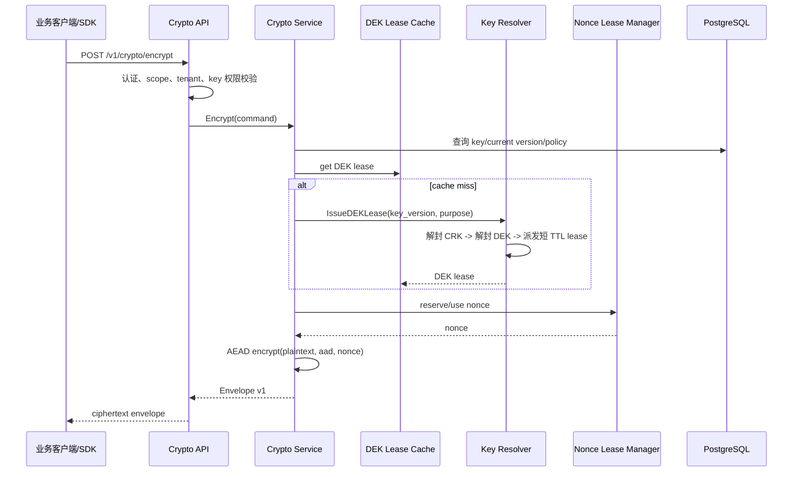

关键约束：

- 数据面不接触 CRK。
- DEK lease 绑定 `tenant_id`、`key_id`、`key_version`、`purpose`、`suite_id`、`node_id`。
- 明文不写日志，不写审计。
- 加密结果携带 Envelope，不依赖外部数据库状态才能解析元数据。

### 9.5 小对象解密流程

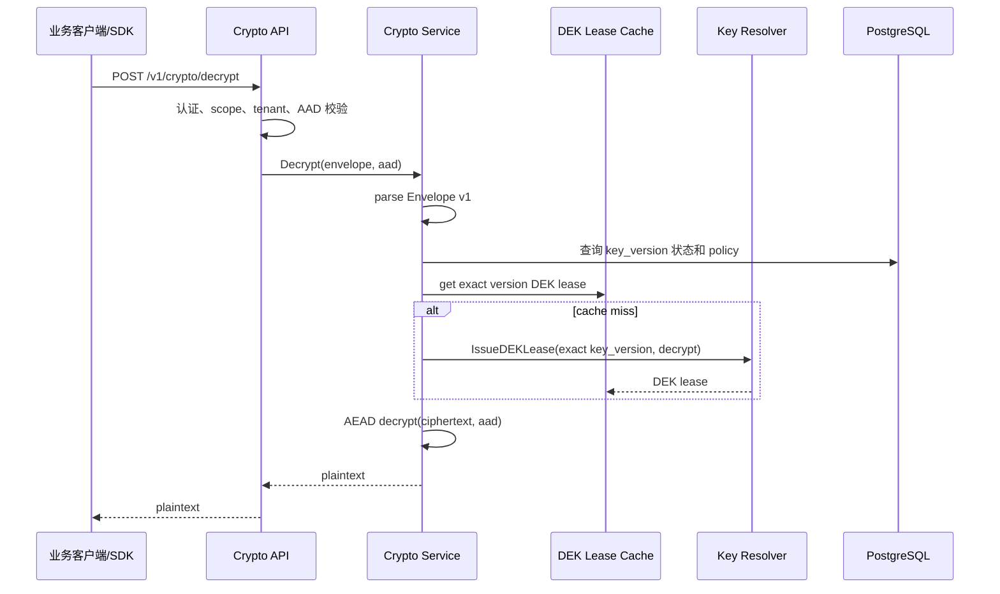

状态规则：

- `ACTIVE`：允许加密和解密。
- `DECRYPT_ONLY`：只允许解密旧密文。
- `DISABLED`：拒绝新加密，可按策略允许解密。
- `DESTROY_PENDING`：禁止新加密，解密按冷静期策略控制。
- `DESTROYED`：拒绝解密。

### 9.6 密钥轮转流程

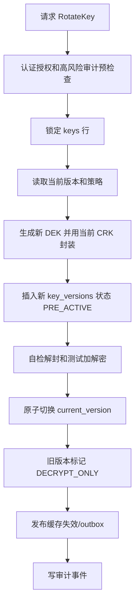

轮转规则：

- 同一 Key 同一时刻只允许一个轮转任务。
- 切换前失败不影响旧版本。
- 切换后部分失败进入补偿任务，不得删除旧版本。
- 轮转后新加密使用新版本，旧密文仍按 Envelope 指向旧版本解密。

### 9.7 DataKey 流程

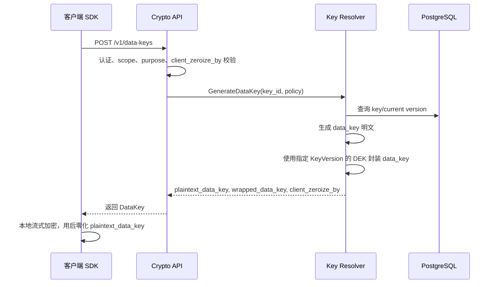

限制：

- DataKey 明文只面向受控业务服务或官方 SDK。
- `wrapped_data_key` 必须是自描述且经认证的 DataKey envelope，绑定 `tenant_id`、`key_id`、`key_version`、`purpose`、DataKey suite、调用方提供的 encryption context 及其版本；只能由同一逻辑 Key 的对应 KeyVersion 解封。禁止使用 CRK 直接封装业务 DataKey，避免绕过 KeyVersion 生命周期、用途约束和轮转审计。
- 返回结果必须有用途、租户、key version 和 `client_zeroize_by` 绑定。该时间只约束官方 SDK 的本地内存生命周期，不表示已交付到调用方的明文可被服务端远程失效。
- 日志和审计不得记录明文 DataKey。

DataKey 客户端使用安全（P0 起强制，SDK 规格）：

- DataKey 明文只在 `defer zeroize()` 保护的临界区内使用，离开临界区前必须零化，不得长期驻留内存。
- 流式加密大对象时，官方 SDK 必须为每个逻辑对象新生成一个 DataKey；不得跨对象复用 DataKey。每个 chunk 必须派生独立子密钥（HKDF），不得直接将 DataKey 明文重复输入 GCM chunk 加密 API。
- 对象头必须携带并认证一个 128-bit 随机 `object_salt`。派生方式固定为 `chunk_key = HKDF-Expand(HKDF-Extract(object_salt, datakey), info = "kvlt-chunk-v1" || key_id || key_version || purpose || chunk_index)`；每个 chunk 使用由 `chunk_index` 编码的 96-bit nonce。SDK 必须限制 chunk 总数使计数器不回绕。服务端 nonce lease 只用于服务端以 KeyVersion DEK 加密的场景，不得与客户端 DataKey 流式加密共用。
- 到达 `client_zeroize_by` 前 SDK 必须主动零化明文和派生子密钥；到达该时间后拒绝继续使用。该本地约束不能替代调用方进程、主机或内存被攻陷时的防护。

DataKey 治理约束（P0 起强制，对应 HA-10）：

- DataKey 接口前置 quota 检查：按 `tenant_id` 维度限流（默认每分钟 N 次，可配置），超限返回 `429 NONCE_EXHAUSTED` 或专用 `RATE_LIMITED`。
- DataKey 的 `client_zeroize_by` 默认 5 分钟、最大不超过 15 分钟；请求中建议时长超过上限必须返回参数错误，而不是静默截断，避免客户端对实际生命周期产生错误假设。
- DataKey 响应必须包含 `key_id`、`key_version`、`suite_id`、`client_zeroize_by`、`purpose` 和绑定的 encryption-context 摘要，便于 SDK 到期拒用并零化。
- DataKey 接口与 `crypto:encrypt`/`crypto:decrypt` 走独立 scope 校验路径，禁止同一 token 同时持有 DataKey 和加解密 scope。
- DataKey 调用必须记录独立审计事件 `datakey.generated`，包含 `tenant_hash`、`key_id_hash`、`purpose`、`zeroize_window`、`caller`（`sdk`/`direct`），不记录明文。
- 异常检测：单租户 DataKey 调用速率突增或 `caller=direct` 占比异常时触发告警，便于识别明文密钥外泄风险。

DataKey 使用关联分析（P1 起强制）：

- 生成-解封配比分析：仅对使用 `POST /v1/data-keys:decrypt` 的服务端解封模式，统计每个 `tenant_id × key_id` 的生成与解封配比并作为异常信号；不得把客户端本地信封加密的正常零服务端解封模式判为异常。
- 跨 IP/节点使用检测：同一 wrapped DataKey 在短时间内被多个不同 IP 或节点用于解密时告警，正常 SDK 使用模式应局限于生成时的客户端。
- 不得把「生成后未出现服务端解封事件」作为默认泄露信号：正常客户端信封加密可永远不调用服务端解封。异常检测应基于 DataKey 生成速率、调用主体/网络位置漂移、以及同一 `wrapped_data_key` 的异常解封模式。
- 关联分析事件纳入 HA-10 异常检测范围，与 DataKey quota、caller 标记共用告警通道。

### 9.8 密钥销毁流程

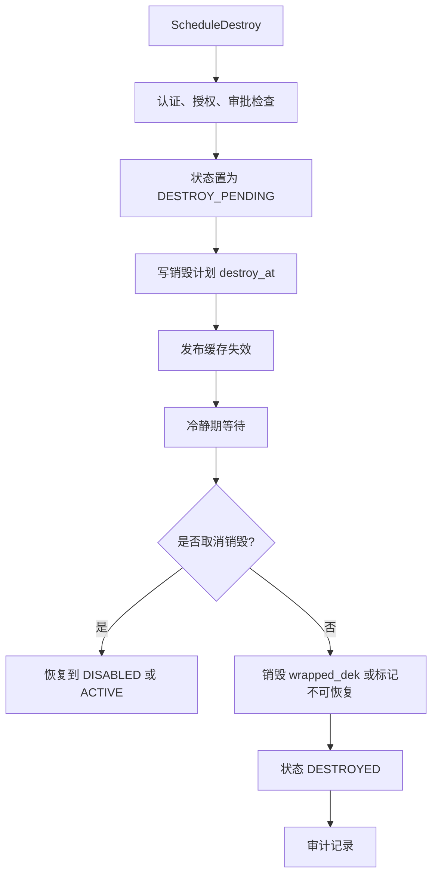

P0 可先实现计划销毁和状态阻断，物理擦除、审批和证明复核放入 P1。

## 10. Crypto Policy Engine

### 10.1 策略内容

策略应独立于加密引擎，避免硬编码算法组合。

```yaml
policy_id: default-v1
version: 1
status: active
default_suite: AES_256_GCM
suites:
  - suite_id: AES_256_GCM
    algorithm: AES
    key_bits: 256
    mode: GCM
    nonce: lease_counter
    status: active
  - suite_id: SM4_GCM
    algorithm: SM4
    key_bits: 128
    mode: GCM
    nonce: lease_counter
    status: active
  - suite_id: AES_256_CBC_HMAC_SHA256
    algorithm: AES
    key_bits: 256
    mode: CBC
    mac: HMAC_SHA256
    composition: encrypt_then_mac
    status: decrypt_only
  - suite_id: SM4_GCM
    algorithm: SM4
    key_bits: 128
    mode: GCM
    nonce: lease_counter
    status: active
    compliance: [GM_T_0054]
```

策略签名字段骨架（P0 起预留，对应 HA-05）：

```yaml
# P0 预留字段，P1 起强制校验
signature:
  alg: ES256         # 签名算法，P0 可空，P1 起必填；国密场景支持 SM2
  key_id: policy-signing-key-v1
  sig: ""            # base64 签名，P0 可空，P1 起必填
  signed_payload_hash: ""  # 规范化策略体的 SHA-256；国密场景可切换 SM3
```

签名与哈希算法注册（P1 起）：

- `signature.alg` 白名单：`ES256`、`RS256`、`SM2`；`SM2` 用于国密/等保密评场景，与 `ES256`/`RS256` 并存。
- `signed_payload_hash` 哈希算法随 `alg` 选择：`ES256`/`RS256` 用 SHA-256，`SM2` 用 SM3。
- 哈希算法注册到 `suite_registry`，策略签名、请求签名和审计哈希链按各自独立的算法标识选择 SHA-256 或 SM3；GCM 的认证标签始终是 GCM/GMAC 定义的一部分，SM3 不能被标记为 `SM4-GCM` 的 MAC。

P0 策略安全默认值（强制）：

- 所有 CBC、ECB 套件默认 `status: decrypt_only`，禁止新加密。
- `default_suite` 必须为 AEAD 套件（GCM 系）。
- 策略降级（将 `active` 套件改为 `decrypt_only` 或 `disabled` 之外的更宽松状态、或启用 ECB 新加密）必须经管理 API 显式审批字段（P0 预留 `approval_id`，P1 起强制非空）。
- P0 策略加载时校验 `signature` 字段存在性（允许空值），P1 起校验签名有效性和 `key_id` 白名单。
- 策略变更必须写审计事件 `policy.changed`，包含 `policy_id`、`old_version`、`new_version`、`changed_suites`。

### 10.2 策略状态

| 状态 | 含义 |
| --- | --- |
| `active` | 可用于新加密和解密。 |
| `decrypt_only` | 仅允许解密历史密文。 |
| `disabled` | 禁止新加密，默认禁止解密，可通过例外策略放行。 |
| `deprecated` | 允许短期兼容，持续告警。 |
| `blocked` | 发现安全风险后立即拒绝。 |

### 10.3 热更新

P0：

- 服务启动加载策略。
- 管理 API 支持查看当前策略。
- 策略变更通过配置发布或重启生效。

P1：

- 签名策略包。
- 管理 API 动态刷新。
- 灰度规则按租户、key、节点池或比例生效。
- 策略降级需要审批和审计。

## 11. 数据模型

### 11.1 核心表

| 表 | 说明 |
| --- | --- |
| `tenants` | 租户信息。 |
| `keys` | 逻辑密钥，保存用途、策略、当前版本和状态。 |
| `key_versions` | 密钥版本，保存 wrapped DEK 和版本状态。 |
| `crk_versions` | CRK 版本元数据。 |
| `crk_node_envelopes` | 为管理/密钥面节点封装的 CRK envelope。 |
| `nodes` | 节点注册、角色、状态、证明纪元。 |
| `attestation_reports` | P1 证明报告、PCR、Event Log 摘要。 |
| `dek_leases` | DEK lease 记录，用于撤销和观测。 |
| `nonce_leases` | GCM nonce 区间分配。 |
| `crypto_policies` | 策略包和签名信息。 |
| `audit_events` | 结构化审计事件。 |
| `audit_chain_heads` | P1 审计哈希链头。 |
| `outbox_events` | 缓存失效、审计外送、任务事件。 |
| `lifecycle_jobs` | 轮转、销毁、重加密等异步任务。 |
| `idempotency_keys` | 幂等请求记录。 |

核心关系图：

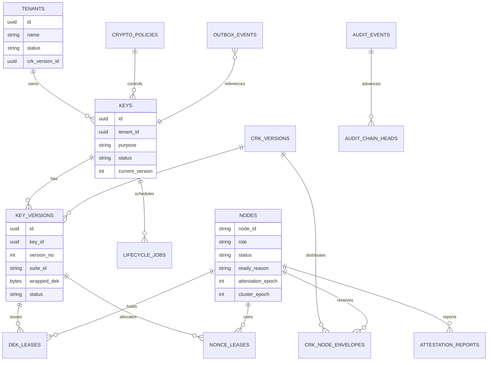

`nodes` 表新增字段（对应 HA-08、HA-11）：

| 字段 | 说明 |
| --- | --- |
| `ready_reason` | 准入依据：`static_registration`（P0）、`attestation`（P1+）。用于审计和风险分级，区分节点是凭静态注册还是凭证明进入 READY。 |
| `attestation_epoch` | 证明纪元快照，P0 写入静态注册时的 `cluster_epoch`，P1 起由 Attestation Service 写入。 |
| `cluster_epoch` | 节点 READY 时集群 epoch 快照，用于 vTPM 回滚检测时比对。 |

`tenants` 表新增字段（P0 预留；相互隔离的生产租户上线前必须启用）：

| 字段 | 说明 |
| --- | --- |
| `crk_version_id` | 租户专属 CRK/tenant KEK 版本引用。P0 可为空，但仅限单租户或同一风险域试点；面向相互隔离的生产租户时必须在上线前启用每租户独立 KEK（可由集群根在受控 KDF/封装域中派生），而非把共享集群 CRK 作为长期默认。这样可将管理/密钥面失陷的密钥材料爆炸半径收敛到单租户，并支持独立轮转、吊销和审计。 |

数据库角色与表权限映射（对应 HA-06，详见 4.4 部署单元）：

| 表 | `kv_app_rw` | `kv_resolver_rw` | `kv_worker_rw` | `kv_audit_w` |
| --- | --- | --- | --- | --- |
| `keys`、`key_versions` | RW | — | R | — |
| `crk_versions`、`crk_node_envelopes` | — | RW | R | — |
| `dek_leases`、`nonce_leases` | RW | RW | R | — |
| `nodes` | RW | R | R | — |
| `crypto_policies` | R | R | R | — |
| `audit_events` | INSERT only | INSERT only | R | SELECT only |
| `audit_chain_heads` | — | — | — | INSERT only |
| `outbox_events` | RW | — | RW（消费标记） | — |
| `lifecycle_jobs` | — | — | RW | — |
| `idempotency_keys` | RW | — | — | — |

约束：

- `crk_node_envelopes` 的明文封装列仅 `kv_resolver_rw` 可读，数据面 DB 角色不得授予该列读权限。
- `audit_events`、`audit_chain_heads` 仅允许追加写（INSERT），禁止 UPDATE/DELETE，由数据库触发器或角色权限强制。
- 所有角色均无 DDL 权限，DDL 仅 `kv_migrate` 在迁移窗口持有。

### 11.2 关键字段

`keys`：

| 字段 | 说明 |
| --- | --- |
| `id` | Key ID。 |
| `tenant_id` | 租户。 |
| `name` | 业务名称。 |
| `purpose` | `encrypt_decrypt`、`datakey` 等。 |
| `policy_id` | 密码策略。 |
| `current_version` | 当前加密版本。 |
| `status` | Key 状态。 |
| `created_at` / `updated_at` | 时间戳。 |

`key_versions`：

| 字段 | 说明 |
| --- | --- |
| `id` | KeyVersion ID。 |
| `key_id` | 所属 Key。 |
| `version_no` | 单调版本号。 |
| `suite_id` | 算法套件。 |
| `wrapped_dek` | CRK 封装后的 DEK。 |
| `wrap_metadata` | CRK 版本、AAD 摘要、封装算法。 |
| `status` | `ACTIVE`、`DECRYPT_ONLY`、`DISABLED`、`DESTROYED`。 |

`nonce_leases`：

| 字段 | 说明 |
| --- | --- |
| `lease_id` | 租约 ID。 |
| `key_version_id` | 密钥版本。 |
| `node_id` | 节点。 |
| `domain` | nonce domain。 |
| `start_counter` | 起始计数。 |
| `end_counter` | 结束计数，不包含。 |
| `used_counter` | 已使用到的位置。 |
| `expires_at` | 过期时间。 |
| `status` | `ACTIVE`、`RELEASED`、`EXPIRED`、`FROZEN`。 |

### 11.3 事务规则

| 操作 | 事务边界 |
| --- | --- |
| 创建密钥 | 写 `keys`、`key_versions`、审计事件、幂等结果同事务。 |
| 轮转密钥 | `SELECT FOR UPDATE` 锁定 `keys` 行，插入新版本并切换 current version 同事务。 |
| 签发 DEK lease | 校验节点、KeyVersion、策略，写 lease 记录。 |
| 分配 nonce | 锁定 KeyVersion 或 nonce domain 计数器，先提交新区间再返回。 |
| 计划销毁 | 状态变更、销毁时间、缓存失效 outbox 同事务。 |
| 高风险审计 P1 | 业务状态变更前同步写 WAL 或同事务写本地审计表。 |

## 12. API 设计

### 12.1 通用约定

- 协议：HTTPS JSON REST。内部服务可后续引入 gRPC。
- 鉴权：`Authorization: Bearer <token>`；服务间可加 `X-KV-Signature`。
- 幂等：写操作支持 `Idempotency-Key`。服务端以 `(authenticated_principal_id, tenant_id, HTTP method, canonical path, idempotency_key)` 建立唯一约束，并保存规范化请求体哈希、最终 HTTP 状态和完整响应摘要。相同键但请求体哈希不同必须返回 `409 IDEMPOTENCY_KEY_REUSED`；不得跨主体、跨租户或跨路由复用。记录至少保留到客户端最大重试窗口之后（推荐 24 小时），清理任务必须可审计。
- 请求追踪：`X-Request-Id`。
- P0 的同步 Encrypt/Decrypt 仅接受小对象：服务端在读取和 base64 解码前执行请求体上限检查，默认明文/密文上限 64 KiB（策略可下调，增大需安全评审）；超限对象必须使用客户端 DataKey 流式加密，不能通过批量或压缩绕过限制。
- JSON 解析必须拒绝重复字段、未知安全字段、无效 UTF-8、数值溢出和尾随数据；请求只接受 `application/json`。不得使用会静默覆盖重复字段的默认解析行为来处理认证、租户、AAD 或算法字段。
- 响应错误：

```json
{
  "error": {
    "code": "KEY_DISABLED",
    "message": "key is disabled",
    "request_id": "req-example-001",
    "retryable": false
  }
}
```

### 12.2 管理 API

| 方法 | 路径 | 功能 | P0 |
| --- | --- | --- | --- |
| `POST` | `/v1/keys` | 创建密钥 | 是 |
| `GET` | `/v1/keys/{key_id}` | 查询密钥 | 是 |
| `GET` | `/v1/keys` | 列表查询 | 是 |
| `POST` | `/v1/keys/{key_id}:enable` | 启用密钥 | 是 |
| `POST` | `/v1/keys/{key_id}:disable` | 停用密钥 | 是 |
| `POST` | `/v1/keys/{key_id}:rotate` | 轮转密钥 | 是 |
| `POST` | `/v1/keys/{key_id}:schedule-destroy` | 计划销毁 | P0/P1 |
| `POST` | `/v1/keys/{key_id}:cancel-destroy` | 取消销毁 | P1 |
| `GET` | `/v1/policies/{policy_id}` | 查询策略 | 是 |
| `POST` | `/v1/policies:reload` | 策略刷新 | P1 |
| `GET` | `/v1/audit/events` | 查询审计 | P1 |

创建密钥请求：

```json
{
  "tenant_id": "t-001",
  "name": "order-data-key",
  "purpose": "encrypt_decrypt",
  "policy_id": "default-v1",
  "suite_id": "AES_256_GCM",
  "tags": {
    "app": "order"
  }
}
```

创建密钥响应：

```json
{
  "key_id": "key_01H...",
  "tenant_id": "t-001",
  "name": "order-data-key",
  "current_version": 1,
  "status": "ACTIVE",
  "policy_id": "default-v1",
  "suite_id": "AES_256_GCM",
  "created_at": "2026-06-17T00:00:00Z"
}
```

### 12.3 数据 API

| 方法 | 路径 | 功能 | P0 |
| --- | --- | --- | --- |
| `POST` | `/v1/crypto/encrypt` | 小对象加密 | 是 |
| `POST` | `/v1/crypto/decrypt` | 小对象解密 | 是 |
| `POST` | `/v1/crypto/batch-encrypt` | 批量加密（P1） | P1 |
| `POST` | `/v1/crypto/batch-decrypt` | 批量解密（P1） | P1 |
| `POST` | `/v1/data-keys` | 生成 DataKey | 是 |
| `POST` | `/v1/data-keys:decrypt` | 解封 DataKey | P1 |

加密请求：

```json
{
  "tenant_id": "t-001",
  "key_id": "key_01H...",
  "plaintext": "base64...",
  "aad": {
    "resource_id": "order-1001",
    "purpose": "order-storage"
  }
}
```

加密响应：

```json
{
  "key_id": "key_01H...",
  "key_version": 1,
  "suite_id": "AES_256_GCM",
  "ciphertext": "base64-envelope-v1"
}
```

解密请求：

```json
{
  "tenant_id": "t-001",
  "ciphertext": "base64-envelope-v1",
  "aad": {
    "resource_id": "order-1001",
    "purpose": "order-storage"
  }
}
```

DataKey 响应：

```json
{
  "key_id": "key_01H...",
  "key_version": 1,
  "plaintext_data_key": "base64...",
  "wrapped_data_key": "base64...",
  "suite_id": "AES_256_GCM",
  "client_zeroize_by": "2026-06-17T00:05:00Z",
  "encryption_context_hash": "base64url-sha256..."
}
```

`tenant_id` 由认证上下文确定，创建、加密、解密和 DataKey 请求体中携带时只能用于与认证主体做一致性校验，不能作为服务端选租户的依据。DataKey 的解封请求必须提交完整 `wrapped_data_key` 和完全相同的 encryption context；服务端先验证其认证标签和绑定关系，再返回明文。 

批量加解密 API（P1）：

面向业务侧批量处理场景（如导出 CSV、备份恢复），降低批量场景的请求延迟和 TLS 握手开销。

```json
// POST /v1/crypto/batch-encrypt 请求
{
  "tenant_id": "t-001",
  "entries": [
    { "key_id": "key_01H...", "plaintext": "base64...", "aad": { "resource_id": "order-1001" } },
    { "key_id": "key_01H...", "plaintext": "base64...", "aad": { "resource_id": "order-1002" } }
  ]
}
```

```json
// 批量响应（各条目独立成功/失败）
{
  "results": [
    { "index": 0, "success": true, "key_version": 1, "suite_id": "AES_256_GCM", "ciphertext": "base64-envelope-v1" },
    { "index": 1, "success": false, "error_code": "KEY_DISABLED" }
  ]
}
```

批量 API 设计约束：

- 单次请求条目数上限默认 100，可配置；超限返回 `400 BATCH_TOO_LARGE`。
- 服务端并行处理条目，但 nonce 区间在单事务内一次性分配，避免多次行锁竞争。
- 响应按 `index` 对应请求条目，单条目失败不影响其他条目，整体不因部分失败回滚。
- 批量解密同样支持，每条目独立校验 AAD、状态、权限；批量解密的异常解密检测纳入 HA-10 关联分析。
- 批量 API 与单对象 API 共用同一 scope（`crypto:encrypt`/`crypto:decrypt`），不额外新增 scope。
- 批量请求受单租户速率限制约束，避免单请求耗尽 nonce 区间。

### 12.4 API 调用关系图

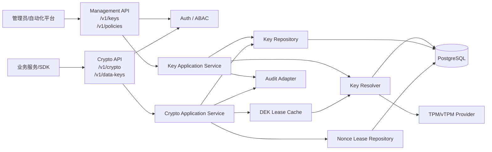

API 边界要求：

- `Management API` 不返回明文密钥材料。
- `Crypto API` 不暴露密钥管理操作。
- `Key Resolver` 不暴露公网入口，只接受内部受控调用。
- `TPM/vTPM Provider` 只被密钥面调用，数据面不得直接调用。

## 13. Go 工程设计

### 13.1 推荐技术栈

| 领域 | 建议 |
| --- | --- |
| HTTP 框架 | `net/http` + `chi` 或 `gin`，优先选择团队熟悉且中间件生态稳定的方案。 |
| 数据库 | PostgreSQL + `pgx`，迁移使用 `golang-migrate`，查询可选 `sqlc`。 |
| 配置 | YAML/ENV，支持配置校验和安全默认值。 |
| 日志 | `log/slog` 或 `zap`，强制脱敏字段过滤。 |
| TPM | `github.com/google/go-tpm`，P0 可用 `swtpm` 做集成测试。 |
| JWT/OIDC | OIDC/JWK 校验库，固定 issuer、audience、alg 白名单。 |
| HMAC 签名 | Go 标准库 `crypto/hmac`、`crypto/sha256`。 |
| AES/GCM | Go 标准库 `crypto/aes`、`crypto/cipher`。 |
| SM4 | 成熟国密库，封装接口并做 KAT/性能/安全评审。 |
| 测试 | `testing`、`testcontainers-go`、swtpm、PostgreSQL 集成环境。 |

### 13.2 推荐目录

```text
cmd/
  key-vault/
    main.go
internal/
  api/
    admin/
    crypto/
    middleware/
  application/
    keys/
    crypto/
    nodes/
    policies/
  domain/
    key/
    policy/
    node/
    audit/
  repository/
    postgres/
  resolver/
    keyresolver/
  crypto/
    aead/
    envelope/
    nonce/
    datakey/
  tpm/
    provider/
    swtpm/
  auth/
    jwt/
    hmacsign/
    principal/
  audit/
    sink/
    redaction/
  jobs/
    lifecycle/
    outbox/
  config/
  observability/
migrations/
deploy/
scripts/
```

### 13.3 低耦合模块边界

| 模块 | 职责 | 禁止依赖 |
| --- | --- | --- |
| `api/admin` | 管理路由、参数校验、权限中间件 | 不直接写 SQL，不调用 TPM。 |
| `api/crypto` | 数据面路由、大小限制、Envelope 输入输出 | 不注册管理路由，不访问 CRK envelope。 |
| `application` | 用例编排、事务边界、审计触发 | 不依赖具体 HTTP 框架。 |
| `domain` | 状态机、领域规则、策略判断 | 不依赖数据库、HTTP、TPM。 |
| `repository` | PostgreSQL 读写、事务、锁 | 不包含业务状态决策。 |
| `resolver` | DEK wrap/unwrap、DEK lease、CRK 临界区 | 不对外暴露 HTTP。 |
| `crypto` | AEAD、Envelope、AAD、nonce、零化 | 不知道租户授权。 |
| `auth` | JWT/HMAC/Principal 解析 | 不写业务数据。 |
| `audit` | 审计事件构造、脱敏、输出 | 不记录敏感明文。 |

状态迁移集中化约束（P0 起强制，对应 HA-06）：

- `Key`、`KeyVersion`、`Node` 的状态迁移函数必须集中在 `internal/domain` 对应子包，以纯函数或领域服务形式实现，输入为当前状态 + 触发事件，输出为新状态或错误。
- `repository` 层只负责持久化领域层计算出的新状态，禁止在 SQL、触发器或应用层散落状态判断逻辑。
- `application` 层调用领域层状态迁移函数后，再调用 repository 持久化，禁止 application 层自行拼凑状态字符串。
- 状态迁移函数必须有完整单元测试覆盖合法迁移路径和非法迁移拒绝路径，非法迁移必须返回错误而非静默接受。
- DB 角色权限（见 11.1）保证即使应用层被绕过，`kv_app_rw` 也无法直接 UPDATE 状态列到非法值（通过 CHECK 约束或触发器辅助）。
- `current_version` 切换、`wrapped_dek` 写入、状态变更必须在同一数据库事务内，由 application 层编排，repository 层不跨表自行决策。

### 13.4 核心接口

```go
type KeyService interface {
    CreateKey(ctx context.Context, cmd CreateKeyCommand) (*KeyDTO, error)
    GetKey(ctx context.Context, tenantID, keyID string) (*KeyDTO, error)
    DisableKey(ctx context.Context, cmd ChangeKeyStateCommand) error
    RotateKey(ctx context.Context, cmd RotateKeyCommand) (*KeyVersionDTO, error)
    ScheduleDestroy(ctx context.Context, cmd DestroyKeyCommand) error
}

type CryptoService interface {
    Encrypt(ctx context.Context, cmd EncryptCommand) (*EncryptResult, error)
    Decrypt(ctx context.Context, cmd DecryptCommand) (*DecryptResult, error)
    GenerateDataKey(ctx context.Context, cmd GenerateDataKeyCommand) (*DataKeyResult, error)
}

type KeyResolver interface {
    GenerateAndWrapDEK(ctx context.Context, policy CryptoPolicy) (*WrappedDEK, error)
    IssueDEKLease(ctx context.Context, req DEKLeaseRequest) (*DEKLease, error)
}

type TPMProvider interface {
    EnsureNRWK(ctx context.Context) (*TPMObjectRef, error)
    SealCRK(ctx context.Context, crk []byte, aad CRKAAD) (*CRKEnvelope, error)
    UnsealCRK(ctx context.Context, envelope CRKEnvelope, aad CRKAAD) ([]byte, error)
    Quote(ctx context.Context, nonce []byte, pcrs []int) (*QuoteResult, error)
}
```

## 14. 状态机

### 14.1 Key 状态

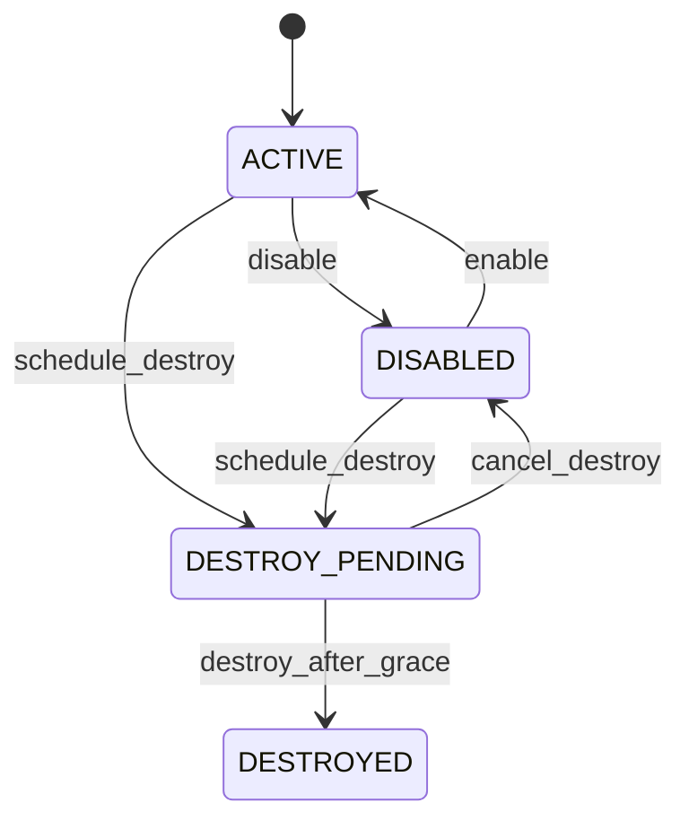

### 14.2 KeyVersion 状态

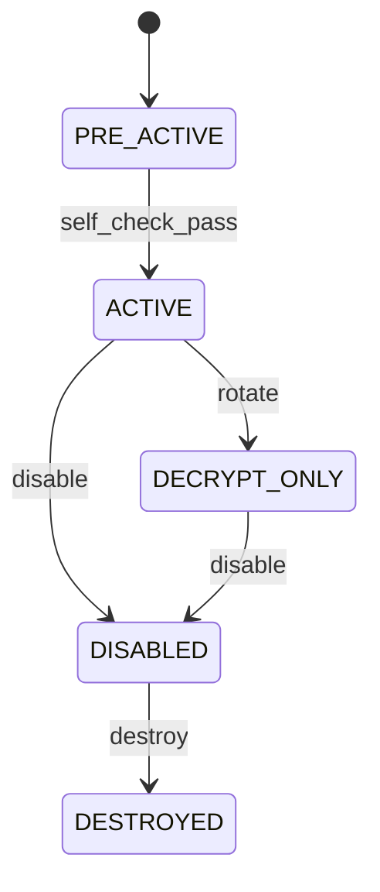

### 14.3 Node 状态

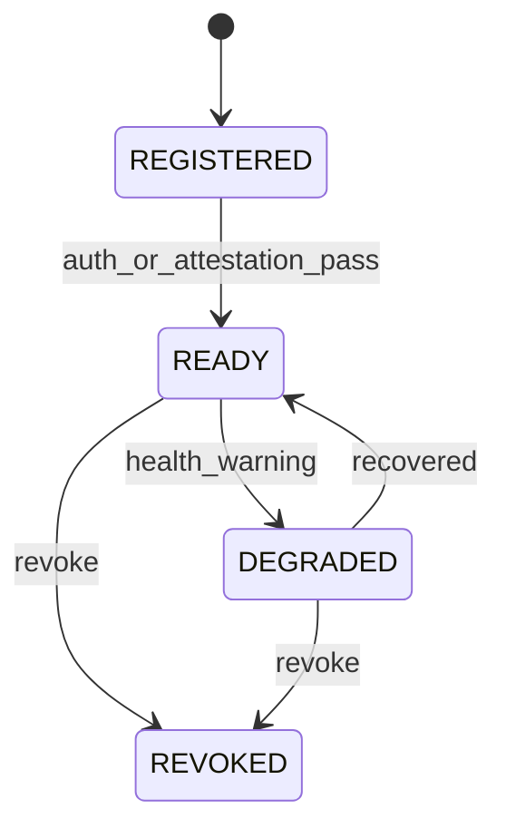

## 15. 审计设计

### 15.1 P0 基础审计

P0 先实现结构化审计事件，满足排障和基本追踪：

| 字段 | 说明 |
| --- | --- |
| `event_id` | 事件 ID。 |
| `request_id` | 请求 ID。 |
| `tenant_hash` | 租户脱敏标识。 |
| `actor_type` | user、service、node。 |
| `actor_hash` | 操作者脱敏标识。 |
| `action` | 操作类型。 |
| `target_type` | key、key_version、node、policy。 |
| `target_id_hash` | 目标脱敏标识。 |
| `result` | success、failed、denied。 |
| `error_code` | 失败错误码。 |
| `timestamp` | 时间戳。 |
| `metadata` | 非敏感上下文。 |

敏感字段禁止记录：

- Token、Authorization header。
- 明文、DataKey 明文。
- DEK、CRK。
- wrapped_dek 完整值。
- 完整 Envelope。

高风险操作本地 WAL 骨架（P0 起强制，对应 HA-07）：

P0 必须为高风险操作提供本地 WAL 骨架，确保审计不可用时高风险操作 fail-closed，而非静默成功。

| 高风险操作 | P0 处理 | P1 升级 |
| --- | --- | --- |
| 创建 CRK | 本地 WAL 写入成功后再提交业务事务 | 同步 WAL + 哈希链 |
| 节点注册/撤销 | 本地 WAL 写入成功后再提交 | 审批 + 证明报告归档 |
| 密钥销毁（进入 DESTROY_PENDING） | 本地 WAL 写入成功后再提交 | 审批 + 冷静期 + WAL |
| 策略降级 | 本地 WAL 写入成功后再提交 | 审批 + 签名策略包 |
| 密钥轮转 | 本地 WAL 写入成功后再提交 | 同步 WAL + 哈希链 |

WAL 骨架实现要求：

- WAL 文件独立于业务数据库，使用追加写 + fsync，避免数据库故障导致 WAL 丢失。
- WAL 写入失败时，对应高风险操作必须 fail-closed 拒绝，不得降级为仅写结构化审计事件。
- WAL 记录包含 `event_id`、`action`、`target_hash`、`actor_hash`、`timestamp`、`request_id`、`prev_wal_hash`（P0 可空，P1 起填充形成哈希链）。
- WAL 文件按大小或时间滚动，保留周期至少覆盖一次恢复演练窗口。
- P0 不要求 WAL 外部锚定，但必须提供 WAL 回放工具，能在恢复时重放高风险操作序列。
- WAL 与 `audit_events` 表关系：WAL 是高风险操作的强一致前置证据，`audit_events` 是全量结构化事件；P1 起 Audit Forwarder 消费 WAL 并推进哈希链。

### 15.2 P1 哈希链

```text
current_hash = H(prev_hash || canonical(event_payload) || timestamp || sequence)
# H 默认为 SHA-256；国密/等保密评场景可切换 SM3
```

规则：

- 每条记录包含 `prev_hash` 和 `current_hash`。
- 按租户或全局链维护 `sequence`。
- 删除、截断、重排、篡改可由验证工具检测。
- 每小时或按事件数发布链头到外部不可变存储。
- 哈希算法由 `suite_registry` 选择，支持 SHA-256（默认）与 SM3（国密场景）平行路径；同一链内算法不得中途切换，切换必须开新链并记录 `chain.algorithm_changed` 事件。
- 链头记录携带 `algorithm` 字段，验证工具按链头声明的算法校验，避免算法混淆。

### 15.3 高风险操作

| 操作 | P0 | P1 |
| --- | --- | --- |
| 创建 CRK | 结构化审计 | 同步 WAL + 哈希链。 |
| CRK 轮转 | 暂不实现或人工流程 | 审批 + 同步 WAL。 |
| 节点注册/撤销 | 审计 | 审批 + 证明报告归档。 |
| 密钥导出 wrapped key | P1 | 审批 + 同步 WAL。 |
| 密钥销毁 | 计划状态 + 审计 | 审批 + 冷静期 + WAL。 |
| 策略降级 | P1 | 审批 + 签名策略包。 |
| `cluster_epoch` 变更 | 独立审计事件 `cluster_epoch.changed` + 本地 WAL 骨架 | 哈希链 + 外部锚点校验。 |

`cluster_epoch` 变更审计强化（P0 起强制）：

- `cluster_epoch` 变更必须先写本地 WAL 骨架再提交数据库事务，WAL 写入失败则事务回滚（fail-closed）。
- 审计事件包含 `old_epoch`、`new_epoch`、`trigger`、`operator`、`node_id`（如适用）、`crk_version`（如适用），便于回溯和异常检测。
- P1 起将 `cluster_epoch.changed` 事件纳入哈希链，并定期与外部锚点（WORM/Object Lock）比对，防止 DBA 权限被滥用绕过 vTPM 回滚检测。
- 异常检测：`cluster_epoch` 在短时间内频繁变更、或变更 `trigger=manual` 占比异常时告警。

## 16. 运维与恢复设计

### 16.1 P0 运维功能

| 功能 | 说明 |
| --- | --- |
| 健康检查 | DB、配置、策略、TPM provider 可用性。 |
| 就绪探针 | 节点状态、角色、认证配置、关键依赖。 |
| 指标 | 请求量、错误率、p95/p99、缓存命中率、nonce 使用率。 |
| 配置校验 | 启动前校验弱算法、默认密钥、日志敏感字段。 |
| 备份说明 | 数据库备份、CRK envelope、策略、节点信息分域备份。 |

### 16.2 P1/P2 运维功能

| 功能 | 说明 |
| --- | --- |
| 自动证明准入 | 节点启动必须提交 Quote/Event Log，通过后 READY。 |
| 周期复核 | 定期重新证明，失败后撤销 lease 和节点状态。 |
| Recovery Runbook as Code | 自动拉起隔离环境，恢复快照，验证 epoch、测试 DEK、审计链。 |
| 故障注入 | DB、TPM、缓存、审计 sink、网络分区。 |
| 容量治理 | nonce 区间、TPM 解封频率、审计积压、worker backlog。 |
| 应急响应 | 节点失陷、nonce 风险、CRK 疑似泄露、审计不可用。 |

### 16.3 恢复演练流程

```mermaid
flowchart TD
    A["创建隔离恢复环境"] --> B["恢复数据库快照"]
    B --> C["加载 CRK envelope 和策略包"]
    C --> D["验证 epoch 和版本连续性"]
    D --> E["尝试解封测试 DEK"]
    E --> F["验证旧密文解密"]
    F --> G["执行测试密钥轮转"]
    G --> H["回放审计链"]
    H --> I["生成恢复报告"]
    I --> J["人工签字确认"]
```

## 17. SDK 设计

### 17.1 P0 SDK 范围

P0 可先提供 Go SDK，封装：

- Token/HMAC 请求签名。
- `Encrypt`、`Decrypt`、`GenerateDataKey`。
- Envelope v1 序列化/反序列化。
- AAD canonical encoding。
- DataKey 明文零化。
- 重试、超时、幂等键和错误映射。

### 17.2 P1 SDK 增强

- 流式加密，大文件分块认证。
- DataKey 本地短 TTL 缓存。
- 多语言兼容测试向量。
- 密文头格式稳定性测试。
- SDK 内置安全默认值，禁止业务方手工拼接密文头。

流式加密建议：

- 每个分块独立 nonce。
- 每个分块带 chunk index 和 total count AAD。
- 文件头记录 key、version、suite、chunk size、aad hash。
- 解密时逐块认证，任一块失败则整体失败。

## 18. 错误码与日志

### 18.1 错误码

| code | HTTP | retryable | 说明 |
| --- | --- | --- | --- |
| `AUTH_FAILED` | 401 | false | Token/JWT/HMAC 校验失败。 |
| `PERMISSION_DENIED` | 403 | false | scope、ABAC、租户不匹配。 |
| `KEY_NOT_FOUND` | 404 | false | Key 不存在。 |
| `KEY_DISABLED` | 409 | false | 密钥不可用于当前操作。 |
| `KEY_DESTROYED` | 410 | false | 密钥已销毁。 |
| `POLICY_DENIED` | 400 | false | 策略不允许算法或用途。 |
| `AAD_MISMATCH` | 400 | false | AAD 校验失败。 |
| `ENVELOPE_INVALID` | 400 | false | 密文格式损坏。 |
| `NONCE_EXHAUSTED` | 429 | true | nonce 租约耗尽或续租失败。 |
| `TPM_UNAVAILABLE` | 503 | true | TPM/vTPM 不可用。 |
| `DB_CONFLICT` | 409 | true | 并发状态冲突。 |
| `IDEMPOTENCY_KEY_REUSED` | 409 | false | 幂等键已用于同一路由但请求语义不同。 |
| `AUDIT_UNAVAILABLE` | 503 | true | 高风险审计不可用。 |
| `RATE_LIMITED` | 429 | true | DataKey 或加密接口 quota 超限。 |

错误码统一处理原则（P0 起强制，对应 HA-11）：

- 跨租户的资源访问，无论资源不存在还是权限不足，统一返回 `PERMISSION_DENIED`（推荐）或统一返回 `KEY_NOT_FOUND`，由全局配置选定，禁止按真实原因区分，避免存在性枚举。
- 错误响应 `message` 字段为通用人类可读描述，不得包含租户内部命名、内部状态机细节、内部节点 ID、SQL 错误、堆栈信息。
- 数据面与管理面对外错误模型一致，数据面不得返回管理面专属错误码（如 `nodes:manage` 相关错误）。
- 内部错误（如 DB 连接失败、TPM 异常）统一映射为 `TPM_UNAVAILABLE` 或 `DB_CONFLICT`，不暴露底层组件名和版本。
- 错误响应时间差异需通过统一处理路径收敛：所有 404/403 路径必须执行等价工作量（如统一查询 + 统一延迟填充），避免基于时延的存在性侧信道。
- `RATE_LIMITED` 与 `NONCE_EXHAUSTED` 区分：前者为租户 quota 超限，后者为节点 nonce 区间耗尽，便于运维定位但对外都返回 429。
- 错误码 `code` 字段稳定，`message` 可调整；客户端不得依赖 `message` 文本做分支判断。

### 18.2 日志字段

允许记录：

- `request_id`
- `tenant_hash`
- `actor_hash`
- `key_id_hash`
- `action`
- `status`
- `duration_ms`
- `error_code`

禁止记录：

- 原始 token。
- 明文。
- DEK/CRK。
- `plaintext_data_key`。
- 完整 `wrapped_dek`。
- 完整 Envelope。

## 19. 测试与验收

### 19.1 P0 测试矩阵

| 类型 | 内容 |
| --- | --- |
| 单元测试 | 状态机、策略判断、AAD canonical、Envelope、nonce 分配、HMAC 签名。 |
| 密码测试 | AES-GCM KAT、SM4 KAT、篡改 tag、错 AAD、错 nonce、错版本。 |
| TPM 集成 | swtpm 创建 NRWK、封装/解封 CRK、重启后恢复。 |
| API 集成 | 创建、查询、停用、轮转、加密、解密、DataKey。 |
| 授权负向 | 过期 token、错 audience、错租户、缺 scope、数据面调管理 API。 |
| 并发一致性 | 并发轮转、并发 nonce、幂等重放、DB 锁冲突。 |
| 敏感日志 | 扫描日志确认无 token、明文、DEK、CRK。 |

### 19.2 P0 验收清单

- [ ] 创建密钥后数据库只保存 wrapped DEK。
- [ ] API 不返回 DEK 明文，DataKey 除外且带 TTL 和用途约束。
- [ ] 数据面无法调用管理 API。
- [ ] 数据面不访问 TPM，不读取 CRK envelope。
- [ ] AES-256-GCM 加解密端到端成功。
- [ ] SM4-GCM 至少通过 KAT 和端到端测试。
- [ ] 轮转后新密文使用新版本，旧密文仍可解密。
- [ ] GCM nonce 并发、崩溃、耗尽测试无复用。
- [ ] JWT/HMAC 越权、跨租户、过期、算法混淆全部拒绝。
- [ ] 结构化审计记录关键操作且无敏感字段。
- [ ] Golden Test Vectors（Envelope v1、AAD Canonical、Nonce Lease）固化并作为 CI 门禁。
- [ ] 前向兼容性测试套件覆盖未知字段、新 Suite ID、版本协商场景。
- [ ] 宿主机安全基线检查生效，基线不符节点拒绝 READY。
- [ ] `cluster_epoch` 变更写入独立审计事件和本地 WAL 骨架。
- [ ] nonce lease 分配-使用关联监控生效，异常分配模式触发告警。

### 19.3 P1/P2 验收清单

- [ ] Attestation Service 自动校验 Quote/Event Log/PCR/baseline。
- [ ] 未 READY 节点无法获得 CRK envelope 或 DEK lease。
- [ ] 审计哈希链可检测删除、截断、重排和篡改。
- [ ] 外部锚点可用于事后验证。
- [ ] 恢复演练可自动输出报告。
- [ ] CRK 轮转、节点撤销、证明撤销可清理 lease 和 envelope。
- [ ] 策略签名包支持灰度和禁用旧算法。
- [ ] SDK 流式加密和跨语言 Envelope 测试通过。

### 19.4 Golden Test Vectors 与兼容性测试（P0 起强制）

Envelope v1 和 AAD Canonical Format 是长期不可变的数据格式，一旦发布极难修改，必须在 P0 固化测试向量并作为 CI 门禁。

Golden Test Vectors 范围：

- Envelope v1 二进制格式：覆盖各 `suite_id`（AES_256_GCM、SM4_GCM、AES_256_CBC_HMAC_SHA256、SM4_CBC_HMAC_SM3）、各 `key_version`、典型 AAD、空 AAD、最大长度 AAD。
- AAD Canonical Format：覆盖 CRK AAD（7 字段）、DEK AAD、业务 AAD 三类，包括字段顺序、编码、空值、特殊字符、超长字段。
- Nonce Lease 协议：覆盖区间分配、续租、耗尽、回收的典型向量。
- 测试向量以独立 JSON/二进制文件形式版本化管理，永久保留，禁止覆盖历史版本。

CI 门禁要求：

- 任一 SDK 或服务端实现必须通过 Golden Test Vectors 全部用例才能发布。
- Envelope、AAD canonical、suite registry 的修改必须触发兼容性评审，新增测试向量并保留旧向量。
- 测试向量跨语言复用，Go/Java/Python/Rust SDK 共用同一份向量集。

前向兼容性测试套件：

- 模拟未来字段扩展：在 v1 Envelope 中设置未知 flag、预留字段或长度不一致的扩展，验证旧版 SDK/服务端一律安全拒绝而不崩溃；新增安全语义必须通过新的 Envelope `version` 发布，不能依赖旧版静默忽略。
- 模拟新 Suite ID：新增未识别的 `suite_id`，验证旧版实现按策略拒绝或降级，不崩溃。
- 模拟版本协商：Envelope `version=2`（未来版本）的向量，验证旧版实现按 INV-08 策略可回溯解密 `version=1` 密文。
- 前向兼容性测试向量与 Golden Test Vectors 同等管理，作为 CI 门禁。

Envelope 模糊测试（P0 起强制）：

- 使用 Go 原生 fuzzing（`testing.F`）或 `go-fuzz` 覆盖 `ParseEnvelope` 全路径，纳入 P0 测试矩阵和 CI 门禁。
- 模糊输入来源：随机字节流、截断的合法 Envelope、length 字段越界、magic 篡改、超长 `key_id`/`nonce`、畸形 AAD hash。
- 不变量：解析异常输入必须返回 `ErrEnvelopeInvalid`，不得 panic、不得越界读、不得分配失控缓冲。
- 模糊测试语料库纳入版本化管理，发现的崩溃用例必须转为回归测试向量并永久保留。
- 模糊测试覆盖与 Golden Test Vectors 同等发布门禁，未通过禁止发布。

## 20. 技术规划

### 20.1 插入位置分析

技术规划章节放在“测试与验收”之后、“阶段实施路线”之前。原因如下：

| 位置 | 适配性 | 分析 |
| --- | --- | --- |
| 放在架构章节之后 | 不推荐 | 架构章节关注系统形态，过早放技术规划会打断从目标、边界到核心机制的推导。 |
| 放在工程设计之后 | 可行但不最佳 | 工程设计只覆盖 Go 代码结构，技术规划还涉及安全、运维、兼容和演进，范围更宽。 |
| 放在测试与验收之后、实施路线之前 | 推荐 | 前文已经明确功能、架构、数据、API、安全、测试要求；技术规划可以承接这些约束，回答“技术路线如何选择、如何演进、哪些先攻关”，再进入具体实施路线。 |
| 放在实施路线之后 | 不推荐 | 实施路线需要以技术规划作为输入，放在后面会让阶段任务缺少技术依据。 |

因此本文采用以下逻辑：

```mermaid
flowchart LR
    A["功能与架构设计"] --> B["工程、数据、API、状态机"]
    B --> C["审计、运维、SDK、错误日志"]
    C --> D["测试与验收"]
    D --> E["技术规划"]
    E --> F["阶段实施路线"]
    F --> G["横向质量设计"]
```

### 20.2 技术规划目标

技术规划用于约束系统从 P0 到 P3 的技术演进，避免早期实现为了追求快速交付而破坏后续安全、兼容和规模化能力。

规划目标：

- 明确 P0-P3 的技术路线、优先级和依赖关系。
- 明确哪些能力必须首期做实，哪些能力可以预留扩展点后续增强。
- 明确技术选型原则，避免引入过重、过早或难以替换的组件。
- 明确关键技术风险、攻关项和验证方式。
- 明确技术债边界，确保阶段性妥协可被识别、跟踪和偿还。

### 20.3 技术路线总览

```mermaid
flowchart TD
    P0["P0 业务 MVP<br/>Go + PostgreSQL + swtpm<br/>JWT/HMAC + AES/SM4-GCM"] --> P1["P1 生产基础<br/>Attestation + WAL + Worker<br/>策略签名 + Go SDK"]
    P1 --> P2["P2 高保障增强<br/>mTLS/Workload Identity<br/>CRK 轮转 + 外部锚点<br/>Recovery Runbook"]
    P2 --> P3["P3 平台生态<br/>多语言 SDK<br/>多区域/多 Provider<br/>合规证据平台"]

    P0 --> Base["稳定基线<br/>Envelope v1 / AAD / 状态机 / Nonce"]
    Base --> P1
    P1 --> Governance["生产治理<br/>证明 / 审计 / 生命周期"]
    Governance --> P2
    P2 --> Ecosystem["生态化<br/>兼容性 / Conformance / 多环境"]
    Ecosystem --> P3
```

技术路线的核心判断：

- P0 必须稳定数据格式和安全不变量，尤其是 Envelope、AAD、nonce、KeyVersion 状态机。
- P1 重点补生产治理能力，不应大改 P0 密文格式和业务 API。
- P2 重点补高保障身份、CRK 轮转、灾备恢复和容量治理。
- P3 重点补生态、合规和跨环境能力，避免把平台化能力提前塞进 P0。

### 20.4 技术选型原则

| 领域 | 选型原则 | P0 选择 | 后续演进 |
| --- | --- | --- | --- |
| 开发语言 | 优先内存安全相对可控、生态成熟、部署简单 | Go | 保持 Go 为服务端主语言，SDK 可多语言。 |
| API 框架 | 简洁、可观测、可插拔中间件 | `net/http` + `chi` 或 `gin` | 内部高性能链路可补 gRPC。 |
| 数据库 | 强事务、一致性、成熟 HA | PostgreSQL | P2 引入分区、读副本、归档策略。 |
| TPM | 成熟库、可用模拟器、便于测试 | `go-tpm` + `swtpm` | P2 抽象 HSM/TEE/云 KMS Provider。 |
| 加密库 | 标准库优先，禁止自研基础算法 | Go 标准 AES-GCM，成熟 SM4 库 | P2/P3 做硬件加速和合规库替换。 |
| 认证 | P0 低复杂度，P1 可增强 | JWT/HMAC | mTLS、Workload Identity、Attestation Token。 |
| 审计 | P0 可追踪，P1 强完整性 | 结构化审计 | WAL、哈希链、外部锚点。 |
| 部署 | P0 简化，P1 可拆分 | 单集群多副本 | 独立平面、多区域、专用节点池。 |
| SDK | 先服务关键业务 | Go SDK | Java/Python/Node/Rust + conformance。 |

### 20.5 P0 技术规划

P0 的技术策略是“少组件、强边界、稳格式”。不要在 P0 引入复杂控制平面，但必须把会影响长期兼容的基础打牢。

| 技术域 | P0 必做 | P0 不做 | 预留扩展点 |
| --- | --- | --- | --- |
| Envelope | 固化 v1 二进制格式、AAD canonical、suite_id | 不做多版本复杂协商 | `version`、`flags`、suite registry。 |
| 密钥体系 | NRWK、CRK envelope、DEK wrap、KeyVersion 状态 | 不做 CRK 自动轮转 | CRK version、wrap metadata。 |
| 加密引擎 | AES-256-GCM、SM4-GCM、KAT | 不启用 ECB 新加密 | CryptoPolicy suite 状态。 |
| nonce | 数据库租约、高水位预取、耗尽拒绝 | 不做跨区域 nonce | domain 分配策略抽象。 |
| 认证 | JWT/HMAC、scope、ABAC | 不强制 mTLS | Principal 接口、AuthProvider 接口。 |
| 审计 | 结构化审计、脱敏 | 不做外部锚点 | AuditSink 接口、event canonical。 |
| 运维 | 健康检查、基础指标、日志 | 不做自动恢复演练 | Runbook skeleton。 |

P0 技术验收：

- Envelope v1 测试向量固定。
- AAD canonical 修改必须触发兼容性评审。
- nonce 并发、崩溃、耗尽测试通过。
- 数据面无 CRK/TPM 依赖。
- 敏感日志扫描通过。

### 20.6 P1 技术规划

P1 的技术策略是“生产治理补齐”。P1 不应推翻 P0 的 API 和密文格式，而应围绕证明、审计、worker、策略和 SDK 增强。

| 技术域 | P1 规划 | 关键验证 |
| --- | --- | --- |
| Attestation | 独立 Attestation Service、baseline 包、节点 READY 状态 | PCR/Event Log 失败拒绝；证明过期撤销 lease。 |
| 审计 | WAL、哈希链、验证工具 | 删除、截断、重排、篡改可检测。 |
| 生命周期 | outbox、worker、任务幂等、补偿 | worker 崩溃后可续跑。 |
| 策略 | 签名策略包、热更新、灰度骨架 | 未签名策略拒绝；旧密文可解密。 |
| SDK | Go SDK 完整封装、DataKey、本地零化 | SDK E2E、错误映射、重试策略通过。 |
| 认证 | 管理面可选 mTLS，服务间身份增强 | 证书错误拒绝；JWT/HMAC 兼容保留。 |

Attestation Service 容灾（P1 起强制）：

- Attestation Service 必须多副本部署，基线数据通过数据库复制或配置同步保证一致性。
- AS 故障降级策略：AS 不可用时允许已 READY 节点基于现有证明结果续期 lease（续期窗口默认 1 小时，可配置），但拒绝新节点准入和已过期证明的节点重新 READY。
- AS 故障期间所有证明相关操作强化审计，恢复后必须补齐证明复核，对降级期间续期的节点重新执行远程证明。
- AS 基线数据变更必须版本化管理，支持灰度发布和回滚，避免基线错误导致全集群节点不可 READY。
- AS 故障累计时长超过阈值（默认 4 小时，可配置）后，已 READY 节点进入 `DEGRADED` 状态：触发告警，不自动撤销节点，但禁止向该节点分发新 CRK envelope，避免证明强度无限期退化为 P0 静态注册水平。
- AS 恢复后设置补证明窗口（默认 2 小时内必须完成），窗口内未完成补证明的节点降级或撤销 lease。

### 20.7 P2 技术规划

P2 的技术策略是“高保障与规模化”。重点解决高安全租户、合规业务和多节点复杂运维问题。

| 技术域 | P2 规划 | 关键验证 |
| --- | --- | --- |
| 强身份 | mTLS 默认化、Workload Identity、证书自动轮换 | 证书轮换不中断；错证书拒绝。 |
| CRK 轮转 | 新 CRK、批量重封装、审批、冷静期、回滚 | 切换失败可恢复；旧密文可解密。 |
| 外部锚点 | WORM/Object Lock/透明日志 | 可从锚点验证审计链。 |
| 恢复演练 | Recovery Runbook as Code | 自动恢复、测试 DEK、审计链报告。 |
| 性能容量 | SLO、限流、TPM 压力保护、nonce 水位治理 | 压测报告和容量模型可复现。 |
| 算法迁移 | decrypt-only、灰度、重加密框架 | CBC/ECB 禁用新加密不影响旧密文。 |

### 20.8 P3 技术规划

P3 的技术策略是“平台化和生态化”。此阶段要谨慎控制兼容性承诺，所有 SDK 和 Provider 都必须通过一致性测试。

| 技术域 | P3 规划 | 关键验证 |
| --- | --- | --- |
| 多语言 SDK | Java、Python、Node、Rust 等 | Conformance suite 全部通过。 |
| 多 Provider | TPM、HSM、云 KMS、TEE | RootKeyProvider 可替换，上层 API 不变。 |
| 多区域 | 区域级 CRK、策略复制、审计复制 | RTO/RPO 演练通过。 |
| 合规证据 | 密钥生命周期、审计链、恢复报告、供应链证据 | 证据包可按租户/周期导出。 |
| 自服务平台 | 租户门户、用量、策略、审计查询 | RBAC/ABAC 严格隔离。 |
| 后量子密码 | ML-KEM 密钥封装、PQC 套件接入 | PQC 套件通过 KAT 和兼容性测试。 |

核心 Crypto Provider 内存安全增强评估（P3 评估项）：

- Go 的 GC 和运行时特性使得完全控制密钥材料内存生命周期极其困难，对金融核心等极高敏感场景存在剩余风险。
- P3 评估将核心 Crypto Provider（CRK 解封、DEK wrap/unwrap、AAD canonical）用 Rust 重写并通过 CGO/FFI 调用，或迁移到 TEE（如 Intel SGX/TDX、AMD SEV-SNP）作为 key-resolver 的运行环境。
- 评估维度：性能开销、部署复杂度、密钥材料隔离强度、与现有 Go 服务端的集成成本、合规认证可行性。
- P3 仅做评估和原型验证，不作为 P0/P1 承诺；P0/P1 阶段通过短 TTL、零化、进程隔离、最小权限等机制缓解 Go 内存安全局限。

后量子密码（PQC）路线图（P3 起规划，P0 预留插槽）：

NIST 已于 2024 年 8 月正式标准化 ML-KEM（CRYSTALS-Kyber）、ML-DSA（CRYSTALS-Dilithium）、SLH-DSA（SPHINCS+），中国 GM/T 标准也在推进格基等抗量子算法。当前设计 P0/P1/P2 不实现 PQC，但必须在 P0 预留插槽并在 P3 给出明确路线：

- Envelope v1 在 P0 预留 PQC 扩展插槽（`flags` bit + `suite_id` 空间，见 8.3），不改变二进制布局。
- P3 引入 ML-KEM 替换 RSA-OAEP 用于密钥传输/封装场景（如跨区域 wrapped key 传输、外部 KMS 互联），复合套件 `ML_KEM_768_AES_256_GCM` 等通过 `suite_registry` 注册。
- P3 评估 ML-DSA 替换策略签名包和 JWT 签名（与 SM2/ES256 并存），SLH-DSA 作为无状态签名备选。
- PQC 算法接入必须通过 KAT、性能基准和兼容性测试；不识别 PQC flag 或 suite 的旧版 SDK 必须明确拒绝，不能忽略 flag 或回退到传统套件解密。
- PQC 路线写入 ADR-003（Envelope v1 格式）的演进附录，明确切换窗口和混合模式（传统 + PQC）过渡期策略。

### 20.9 关键技术攻关项

| 攻关项 | 难点 | 建议阶段 | 验证方式 |
| --- | --- | --- | --- |
| vTPM 信任边界 | 宿主机、快照、迁移、回滚风险 | P0/P1 | 平台安全说明、证明基线、回滚测试。 |
| GCM nonce 租约 | 并发、高水位、崩溃恢复、耗尽处理 | P0 | 压测、故障注入、重复检测。 |
| CRK 明文窗口 | Go GC、内存复制、panic dump、日志误打 | P0/P1 | 代码审查、敏感扫描、内存生命周期测试。 |
| 审计哈希链 | 顺序、并发、锚点、验证性能 | P1 | 删除/重排/截断/篡改测试。 |
| CRK 轮转 | 批量重封装、失败补偿、旧版本保留 | P2 | 演练环境端到端轮转。 |
| 策略热更新 | 灰度、回滚、旧密文兼容 | P1/P2 | 策略签名、灰度、兼容性测试。 |
| 多语言 Envelope | 字节序、AAD canonical、错误处理差异 | P3 | 跨语言测试向量。 |

### 20.10 技术债管理

允许的阶段性技术债必须满足三个条件：有明确风险边界、有偿还阶段、有测试保护。

| 技术债 | 允许阶段 | 风险 | 偿还方式 |
| --- | --- | --- | --- |
| P0 不强制 mTLS | P0 | 服务身份绑定弱于 mTLS | P1/P2 引入 mTLS/Workload Identity。 |
| P0 证明准入简化 | P0 | 节点可信度依赖注册和网络边界 | P1 Attestation Service 自动准入。 |
| P0 审计无外部锚点 | P0 | 审计不可篡改性不足 | P1/P2 WAL、哈希链、外部锚点。 |
| P0 单区域部署 | P0/P1 | 区域级故障恢复能力弱 | P3 多区域和恢复演练。 |
| P0 SDK 语言有限 | P0/P1 | 业务接入成本高 | P3 多语言 SDK。 |

技术债不得触碰：

- CRK/DEK 明文导出。
- GCM nonce 重用。
- 数据面访问 CRK 或 TPM。
- 敏感字段入日志。
- 未认证/未授权请求访问加解密能力。

### 20.11 技术决策记录

建议后续使用 ADR（Architecture Decision Record）管理关键技术决策。每个 ADR 至少包含：

- 决策背景。
- 可选方案。
- 选择结果。
- 安全影响。
- 兼容性影响。
- 运维影响。
- 回滚或替换策略。

首批 ADR 建议：

| ADR | 主题 |
| --- | --- |
| ADR-001 | P0 使用 JWT/HMAC，mTLS 后续增强。 |
| ADR-002 | TPM 只保护 CRK，不参与高频数据加解密。 |
| ADR-003 | Envelope v1 二进制格式和 AAD canonical；含 PQC 预留插槽与演进附录。 |
| ADR-004 | GCM nonce lease 采用 `domain + counter`，domain 绑定 `cluster_epoch`。 |
| ADR-005 | PostgreSQL 作为强一致元数据和租约存储。 |
| ADR-006 | 审计从结构化事件演进到 WAL/哈希链/外部锚点。 |
| ADR-007 | key-resolver 按 `key_id` 一致性哈希路由，failover 降级轮询。 |
| ADR-008 | 国密 SM2/SM3 作为 SHA-256/ES256 平行路径，由 suite_registry 选择。 |

## 21. 阶段实施路线

### 21.1 M0：工程骨架与安全基线

交付：

- Go 工程结构。
- 配置、日志、错误码、健康检查。
- PostgreSQL migrations。
- JWT/HMAC 基础认证。
- 敏感字段脱敏中间件。

退出条件：

- 服务可启动。
- 健康检查通过。
- 认证负向测试通过。

### 21.2 M1：TPM 根与 CRK 原型

交付：

- TPM Provider。
- swtpm 集成测试。
- NRWK 创建/加载。
- CRK envelope 封装/解封。

退出条件：

- 重启后可解封 CRK。
- 错误 TPM/策略无法解封。
- CRK 不落日志、不落普通文件。

### 21.3 M2：密钥管理业务闭环

交付：

- 创建、查询、启用、停用、轮转。
- `keys`、`key_versions`、`idempotency_keys`。
- 基础审计。

退出条件：

- Key 生命周期测试通过。
- 并发轮转和幂等测试通过。

### 21.4 M3：数据加解密业务闭环

交付：

- Encrypt/Decrypt。
- Envelope v1。
- AES-256-GCM、SM4-GCM。
- DEK lease cache。
- nonce lease。

退出条件：

- 加解密端到端通过。
- nonce 租约异常测试通过。
- 数据面不访问 CRK/TPM。

### 21.5 M4：DataKey 与 SDK

交付：

- GenerateDataKey。
- Go SDK。
- AAD canonical。
- 本地 DataKey 零化和错误映射。

退出条件：

- SDK 通过端到端和负向测试。
- 大对象客户端信封加密原型可用。

### 21.6 M5：生产治理增强

交付：

- Attestation Service。
- Lifecycle Worker。
- 审计 WAL/哈希链。
- 策略签名包和热更新。
- Recovery Runbook。

退出条件：

- 自动证明准入通过。
- 审计链验证通过。
- 恢复演练报告可复现。

### 21.7 端到端实施流程

实施不应从“直接写 API”开始，而应先固化安全不变量、数据结构和加密测试向量。推荐按以下闭环推进：

```mermaid
flowchart TD
    A["设计基线冻结<br/>总体设计/不变量/阶段范围"] --> B["工程骨架<br/>配置/日志/错误码/CI"]
    B --> C["数据模型与迁移<br/>keys/key_versions/nodes/leases/audit"]
    C --> D["TPM Provider 原型<br/>swtpm/NRWK/CRK envelope"]
    D --> E["密钥管理用例<br/>Create/Get/Disable/Rotate"]
    E --> F["Envelope 与 Crypto Engine<br/>AES-GCM/SM4-GCM/AAD"]
    F --> G["DEK Lease 与 Nonce Lease<br/>cache/租约/熔断"]
    G --> H["Crypto API<br/>Encrypt/Decrypt/DataKey"]
    H --> I["认证授权<br/>JWT/HMAC/scope/ABAC"]
    I --> J["基础审计与可观测<br/>audit/log/metric/trace"]
    J --> K["端到端测试<br/>正向/负向/并发/崩溃"]
    K --> L["试点部署<br/>单租户/灰度/压测"]
    L --> M["P1 增强<br/>证明/WAL/worker/恢复演练"]
```

关键原则：

- 每一步都必须产生可运行、可测试、可回滚的交付物。
- 加密格式、AAD、nonce、状态机一旦进入 P0 试点，应按兼容性规则管理。
- 认证授权、日志脱敏和安全负向测试不能放到最后补。

### 21.8 P0 详细实施清单

| 顺序 | 工作包 | 主要任务 | 输出物 | 阻塞关系 |
| --- | --- | --- | --- | --- |
| 1 | 工程初始化 | Go module、目录、配置、日志、错误码、CI | 可启动服务骨架 | 无 |
| 2 | 数据库迁移 | 核心表、索引、事务 helper、migration 工具 | migrations、Repository | 1 |
| 3 | 密码基础 | AES-GCM、SM4-GCM、AAD canonical、Envelope v1、KAT | crypto 包、测试向量 | 1 |
| 4 | TPM 原型 | swtpm、NRWK、CRK seal/unseal、错误分类 | TPM Provider | 1 |
| 5 | Key Service | 创建、查询、启停、轮转、状态机 | management-api | 2、3、4 |
| 6 | DEK/Nonce Lease | DEK cache、nonce 区间、预取、水位、熔断 | resolver、nonce manager | 2、3、4 |
| 7 | Crypto API | Encrypt、Decrypt、GenerateDataKey | crypto-api | 3、5、6 |
| 8 | Auth | JWT/HMAC、scope、ABAC、租户隔离 | auth middleware | 5、7 |
| 9 | Audit/Observability | 基础审计、脱敏日志、指标 | audit adapter、metrics | 5、7、8 |
| 10 | E2E 测试 | 正向、负向、并发、崩溃、敏感日志扫描 | 测试报告 | 1-9 |
| 11 | 试点部署 | Docker/K8s、PostgreSQL、swtpm、灰度租户 | 试点环境 | 10 |

### 21.9 P1-P3 增强实施清单

| 阶段 | 工作包 | 主要任务 | 输出物 |
| --- | --- | --- | --- |
| P1 | Attestation Service | Quote/Event Log/PCR/baseline、节点 READY 状态 | 证明准入服务、baseline 包 |
| P1 | Lifecycle Worker | outbox、轮转补偿、销毁、缓存失效 | worker、任务表、重试策略 |
| P1 | 审计 WAL/哈希链 | WAL、hash chain、验证工具雏形 | 审计链和验证命令 |
| P1 | Go SDK 完整版 | 认证、Envelope、DataKey、错误模型 | SDK 和示例 |
| P2 | 强身份 | mTLS、Workload Identity、证书轮换 | 证书发布和轮换流程 |
| P2 | CRK 轮转 | 双人审批、重封装、回滚、冷静期 | CRK rotation runbook |
| P2 | Recovery Runbook | 隔离环境自动恢复、epoch、审计链验证 | 恢复报告 |
| P2 | 容量治理 | 压测、SLO、限流、熔断、告警 | 容量模型和仪表盘 |
| P3 | 多语言 SDK | Java/Python/Rust/Node SDK，conformance suite | SDK 矩阵 |
| P3 | 多 Provider | HSM/云 KMS/TEE Provider 抽象 | RootKeyProvider 插件 |
| P3 | 多区域 | 区域级 CRK/策略/审计复制模型 | 多区域部署方案 |

### 21.10 开发交付流水线

```mermaid
flowchart LR
    Code["代码提交"] --> Unit["单元测试<br/>状态机/策略/crypto"]
    Unit --> Static["静态检查<br/>lint/vuln/secrets"]
    Static --> Integration["集成测试<br/>PostgreSQL/swtpm"]
    Integration --> Security["安全负向测试<br/>auth/AAD/nonce/log"]
    Security --> Build["构建镜像<br/>SBOM/签名"]
    Build --> DeployTest["测试环境部署"]
    DeployTest --> E2E["端到端测试"]
    E2E --> Review["阶段评审<br/>安全/架构/SRE"]
    Review --> Canary["灰度试点"]
    Canary --> Promote["生产发布"]
```

流水线准入：

- crypto 包必须有 KAT 和篡改测试。
- 涉及 Envelope、AAD、suite 的修改必须跑兼容性测试。
- 涉及状态机、轮转、销毁的修改必须跑并发和幂等测试。
- 涉及认证授权的修改必须跑越权、跨租户、重放、过期 token 测试。
- 涉及日志的修改必须跑敏感字段扫描。

### 21.11 阶段评审门槛

| 阶段 | 评审门槛 | 不通过时处理 |
| --- | --- | --- |
| P0 试点前 | 安全不变量测试、加解密 E2E、日志脱敏、nonce 崩溃测试通过。 | 不允许接入真实业务数据。 |
| P1 生产前 | 证明准入、节点撤销、审计 WAL、worker 幂等、恢复演练雏形通过。 | 只能维持试点环境。 |
| P2 高保障前 | mTLS/Workload Identity、CRK 轮转、外部锚点、容量压测通过。 | 不允许承载合规/高敏业务。 |
| P3 平台化前 | 多语言 conformance、多区域演练、合规证据包、SLO 报告通过。 | 不发布平台级兼容性承诺。 |

### 21.12 回滚与应急流程

```mermaid
flowchart TD
    A["发布或策略变更"] --> B{"监控是否异常?"}
    B -- 否 --> C["继续灰度 / 扩大范围"]
    B -- 是 --> D{"是否影响密钥材料或密文格式?"}
    D -- 否 --> E["回滚服务版本或配置"]
    D -- 是 --> F["冻结新加密<br/>保留旧版本解密"]
    F --> G["停止策略扩散 / 禁止销毁旧材料"]
    G --> H["审计影响范围<br/>tenant/key/version/node"]
    H --> I["执行补偿任务或恢复 Runbook"]
    I --> J["安全复盘和兼容性测试补充"]
```

应急优先级：

1. 防止密钥材料继续暴露。
2. 防止 GCM nonce 复用和错误密文继续产生。
3. 保留旧版本解密能力，避免业务数据不可恢复。
4. 冻结销毁、导出、策略降级等高风险操作。
5. 完成审计和影响范围确认后再恢复新加密。

玻璃破碎应急解密通道（P0 Runbook 定义）：

当 TPM/vTPM 完全不可用且无法在可接受时间内恢复时，为避免关键业务数据不可恢复，允许通过"玻璃破碎"流程临时启用应急解密通道。

- 触发条件：TPM/vTPM 物理故障、swtpm 不可恢复损坏、集群级 CRK envelope 全部不可解封，且业务影响达到预设阈值（如关键业务中断超 30 分钟）。
- 启用流程：双人审批（至少两名授权管理员）+ 安全负责人确认 + 操作工单留痕；审批记录和操作日志纳入审计哈希链。
- 应急密钥来源：离线备份的 CRK 分片材料（分域备份，平时不可访问），在隔离恢复环境重组后临时用于解密。
- 操作约束：应急通道仅允许解密，禁止新加密；所有解密操作记录 `caller=break_glass` 标记，强化审计；应急通道启用期间持续告警。
- 事后处理：TPM 恢复后立即禁用应急通道，对应急期间访问的密钥执行 CRK 轮转和 DEK 重封装，重置所有可能受影响的 lease。
- Runbook 必须包含应急通道启用的详细步骤、审批联系人、隔离环境搭建指南和事后清理检查清单。

## 22. 横向设计总览与优化建议

### 22.1 成熟实践对齐收益

- 使用 TPM/vTPM 保护根密钥，降低数据库泄露导致全量解密的风险。
- 信封加密将高频数据加解密与低频根密钥解封解耦。
- 管理面和数据面隔离，降低数据面被攻陷后的破坏能力。
- DEK lease 短 TTL，便于撤销和降低长期明文驻留。
- Envelope 绑定 AAD、策略和版本，降低错用密钥和上下文混淆风险。
- Nonce 租约机制降低 GCM nonce 复用风险。
- 分阶段引入远程证明、审计哈希链和恢复演练，支持生产治理。

### 22.2 剩余风险

| 风险 | 说明 | 缓解 |
| --- | --- | --- |
| vTPM 宿主机边界 | 宿主机管理员、快照、迁移可能影响信任假设。 | 明确平台安全边界；P1 引入远程证明；高保障评估物理 TPM/HSM/TEE。 |
| 明文 DEK 内存暴露 | 加解密时 DEK 必然短时存在于内存。 | 短 TTL、零化、进程隔离、最小权限、后续 memguard/TEE。 |
| P0 无 mTLS | Token/HMAC 相比 mTLS 身份绑定弱。 | IP allowlist、短期 token、请求签名、防重放，P1 升级 mTLS。 |
| Nonce 实现缺陷 | 代码 bug 可能导致重复。 | 数据库租约、KAT、并发/崩溃测试、速率监控、熔断。 |
| 审计初期不完整 | P0 基础审计不能提供强不可篡改证明。 | P1 增加 WAL、哈希链和外部锚点。 |
| 恢复材料集中 | 恢复材料和数据库同域可能导致灾难性泄露。 | 分域备份、审批、分片恢复、隔离演练。 |
| Go 内存安全局限 | Go 的 GC 不可控、panic dump 可能含密钥、goroutine 逃逸、内存复制时机不可预测，导致密钥材料（CRK/DEK 明文）在内存中驻留时间超出预期，无法完全防御内核级或同权限进程攻击。 | 短 TTL 临界区、显式零化、memguard 缓解、core dump 禁用、pprof 默认关闭、panic 零化敏感缓冲区；P3 评估 Rust 重写或 TEE 运行环境。 |
| TPM 软件栈实现局限 | swtpm 作为用户态进程，其密钥材料保护强度低于物理 TPM；TPM2-TSS 库版本漏洞可能影响 NRWK 安全；swtpm 进程被攻陷等同于 vTPM 被攻陷。 | swtpm 独立用户/容器命名空间隔离、TPM2-TSS 版本白名单、宿主机安全基线检查（6.6）、P1 评估物理 TPM 优先策略、P2 评估 HSM 替代。 |

### 22.3 优化建议

| 优先级 | 建议 |
| --- | --- |
| P0 必须 | 数据面无 CRK/TPM；DEK 入库必封装；nonce 无复用且 domain 绑定 `cluster_epoch`；敏感日志脱敏；Token/JWT/HMAC 校验严格；OIDC Discovery 严格校验；Envelope 解析严格长度检查 + 模糊测试；CRK 临界区 `withCRK` 封装。 |
| P1 应做 | Attestation Service 自动准入（含故障 DEGRADED 窗口）；审计 WAL/哈希链（支持 SM3）；生命周期 worker + Cryptoperiod 工单化；策略签名包（支持 SM2）；双人审批；批量加解密 API；Token Introspection/实时撤销；key-resolver 一致性哈希路由；DataKey 流式 HKDF 派生。 |
| P2 增强 | mTLS/Workload Identity/DPoP；外部锚点；Recovery Runbook as Code；HSM/TEE 评估；跨语言 SDK；PostgreSQL 读写分离；Redis nonce 缓存；独立 CRK 租户选项。 |
| P3 演进 | 多语言 SDK/多 Provider/多区域；PQC 路线图（ML-KEM/ML-DSA）；合规证据包；核心 Provider Rust/TEE 评估。 |

## 23. 兼容性设计

### 23.1 API 兼容性

API 兼容性按成熟云服务模式管理：新增字段向后兼容，破坏性变更必须引入新版本。

| 设计项 | 规则 |
| --- | --- |
| URL 版本 | 外部 API 使用 `/v1` 前缀，破坏性变更使用 `/v2`。 |
| 请求字段 | 新增可选字段必须有默认行为；必填字段不得在同一版本中新增。 |
| 响应字段 | 客户端必须忽略未知字段；服务端不得改变现有字段语义。 |
| 错误码 | `code` 稳定，`message` 可调整；客户端不得依赖 message。 |
| 幂等 | 写操作支持 `Idempotency-Key`，重复请求返回相同业务结果。 |
| 分页 | 使用 cursor 或稳定排序字段，避免 offset 在大数据下不稳定。 |
| 弃用 | 先标记 deprecated，再进入 read/decrypt-only，最后移除。 |

### 23.2 Envelope 兼容性

Envelope 是长期数据格式，兼容性要求高于 API。

| 设计项 | 规则 |
| --- | --- |
| magic/version | magic 固定，version 单调递增。 |
| flags | 未识别的关键 flag 必须拒绝，非关键 flag 可忽略。 |
| suite_id | 算法套件只增不改；废弃算法进入 decrypt-only。 |
| AAD | canonical encoding 版本化，hash 绑定到 Envelope。 |
| key_version | 解密必须使用 Envelope 指定版本，不使用 current version。 |
| 测试向量 | 每个 suite 保留跨版本测试向量。 |

兼容性承诺：

- P0 发布后，Envelope v1 不做破坏性修改。
- 新算法通过新增 `suite_id` 支持。
- 旧密文可解密周期由租户策略和合规要求决定，默认不因轮转立即失效。

### 23.3 数据库兼容性

| 场景 | 规则 |
| --- | --- |
| 新增列 | 必须可空或有安全默认值。 |
| 回填 | 大表回填分批执行，避免长事务。 |
| 删除列 | 至少跨两个版本：代码停止使用 -> 数据验证 -> 删除。 |
| 索引 | 并发创建，避免阻塞写入。 |
| 状态枚举 | 新状态发布前，旧代码必须能安全拒绝未知状态。 |
| 迁移回滚 | schema 回滚不得导致密钥材料丢失。 |

### 23.4 算法兼容性

| 算法状态 | 新加密 | 解密 | 典型场景 |
| --- | --- | --- | --- |
| `active` | 允许 | 允许 | 默认推荐算法。 |
| `deprecated` | 允许但告警 | 允许 | 迁移观察期。 |
| `decrypt_only` | 禁止 | 允许 | CBC/ECB 历史兼容。 |
| `disabled` | 禁止 | 默认禁止 | 策略关闭。 |
| `blocked` | 禁止 | 禁止或需应急例外 | 算法发现严重风险。 |

## 24. 安全设计

### 24.1 对标成熟实践

本系统对齐以下成熟实践：

| 成熟实践 | 对齐方式 |
| --- | --- |
| 云 KMS 信封加密 | 使用根密钥/KEK 保护 DEK，业务数据由 DEK 加密；TPM 不承担高吞吐加密。 |
| AWS KMS / Google Cloud KMS 密钥版本化 | Key 与 KeyVersion 分离，轮转生成新版本，旧版本保留解密能力。 |
| HashiCorp Vault lease/audit 模式 | DEK lease 短 TTL、可撤销；审计事件结构化并可外送。 |
| NIST 密钥生命周期 | 明确生成、激活、使用、轮转、停用、销毁、归档和审计。 |
| 零信任服务身份 | 请求身份、节点状态、租户、用途、策略共同参与授权判断。 |

参考资料：

- [AWS KMS Developer Guide](https://docs.aws.amazon.com/kms/latest/developerguide/)
- [Google Cloud KMS envelope encryption](https://cloud.google.com/kms/docs/envelope-encryption)
- [HashiCorp Vault documentation](https://developer.hashicorp.com/vault/docs)
- [NIST SP 800-57 Part 1 Rev. 5](https://csrc.nist.gov/pubs/sp/800/57/pt1/r5/final)

### 24.2 威胁模型

| 威胁 | 风险 | 防护 |
| --- | --- | --- |
| 数据库泄露 | 攻击者获得 wrapped DEK、元数据和审计记录。 | DEK 由 CRK 封装；CRK 不在数据库；敏感审计脱敏。 |
| 数据面节点失陷 | 攻击者利用缓存 DEK lease 解密局部数据。 | 短 TTL、租户/用途绑定、撤销清理、数据面无 CRK。 |
| 管理账号失陷 | 攻击者尝试停用、轮转、销毁、导出。 | scope、ABAC、IP allowlist、高风险审批、审计 WAL。 |
| nonce 重用 | GCM 安全性破坏。 | 数据库租约、预取水位、耗尽 fail-closed、异常速率告警。 |
| 重放请求 | 重复执行管理或数据操作。 | HMAC timestamp + nonce；幂等键；JWT exp/aud。 |
| 策略降级 | 启用弱算法或关闭认证。 | 策略签名、审批、灰度、审计。 |
| vTPM 快照回滚 | 回滚到旧状态导致密钥/epoch 不一致。 | P1 远程证明，P2 epoch/NV counter 和恢复验证。 |
| 日志泄露 | 明文、token、DEK、CRK 泄露。 | 日志字段白名单、脱敏中间件、测试扫描。 |

### 24.3 分层防护

| 层 | P0 | P1/P2 |
| --- | --- | --- |
| 网络 | HTTPS、内网访问、IP allowlist | mTLS、NetworkPolicy、独立管理域名。 |
| 身份 | JWT/HMAC、短期 token | Workload Identity、Attestation Token、MFA。 |
| 授权 | scope + tenant + key policy | ABAC 规则引擎、审批流。 |
| 密钥 | TPM 保护 CRK，DEK 封装入库 | CRK 轮转、分片恢复、HSM/TEE Provider。 |
| 数据 | AEAD、AAD、Envelope | 流式分块认证、跨语言测试向量。 |
| 审计 | 结构化脱敏审计 | WAL、哈希链、外部锚点。 |
| 运维 | 健康检查和基础指标 | 恢复演练、故障注入、SLO 管理。 |

### 24.4 密钥材料内存安全

要求：

- CRK/DEK 明文使用后立即零化。
- 明文密钥对象不实现默认字符串化。
- 错误和日志不得包含 `[]byte` 原文。
- Go 中避免把敏感字节转换成 string。
- 缓存 DEK lease 时必须有 TTL、LRU、容量限制和撤销通道。
- P1/P2 可评估 `mlock`、进程隔离、memguard、TEE，但不得把这些视为对内核级攻击的绝对防护。

panic dump 与核心转储防护（P0 起强制，对应 HA-03）：

- 进程启动时通过 `prctl(PR_SET_DUMPABLE, 0)` 或等价机制禁用核心转储，避免 CRK/DEK 明文被写入 core dump 文件。
- Go runtime panic recovery 必须在所有持有明文密钥的临界区外层包裹，panic 时先零化敏感缓冲区再向上传播，禁止 panic 栈携带敏感字节。
- 错误对象（`error` 接口实现）不得包装敏感字节切片；敏感操作失败时返回通用错误码，详细原因仅写本地 WAL 或内部日志（脱敏后）。
- goroutine panic 被 recover 后，对应请求必须返回 `TPM_UNAVAILABLE` 或 `DB_CONFLICT`，不得继续使用可能未零化的密钥材料。
- 堆 profile、goroutine dump、pprof 端点在 P0 默认关闭，仅在运维明确授权时通过管理 API 短时开启，且开启期间禁止执行涉及 CRK/DEK 明文的操作。
- 内存转储工具、调试器 attach 在生产环境应被 SECCOMP 或容器安全策略禁止。

CRK 临界区函数封装（P0 起强制）：

CRK 明文不得作为 `[]byte` 在调用栈中自由传递，必须在受控函数作用域内使用并强制 defer 零化。key-resolver 必须采用 `withCRK` 模式封装解封-使用-零化生命周期：

```go
// 只在受控函数内使用 CRK 明文，defer 零化，禁止把 crk 传给外部函数后保留引用
func (r *Resolver) withCRK(ctx context.Context, env CRKEnvelope, fn func([]byte) error) error {
    crk, err := r.unseal(ctx, env)
    if err != nil {
        return err
    }
    defer func() { cryptobuf.Zeroize(crk) }()
    return fn(crk)
}
```

- 禁止把 CRK 明文 slice 传给不受控的外部函数后再 `runtime.KeepAlive`，外部函数可能持有 slice header 导致零化失效。
- `crypto/aes.NewCipher` 内部会复制 key 到自身结构体，调用后零化原 `crk` slice 不能清除 cipher 内部副本；cipher 对象使用后必须显式置 nil 并尽快离开作用域，P1/P2 评估 `memguard.LockedBuffer` 缓解。
- CRK 临界区不得跨越数据库事务边界，避免事务 retry 时 CRK 明文被多次暴露（见 9.6 轮转流程、11.3 事务规则）。
- `net/http/pprof` 在 key-resolver 进程默认关闭，pprof heap dump 会包含 goroutine stack，可能含密钥材料。

### 24.5 安全边界图

```mermaid
flowchart TB
    subgraph Untrusted["不可信或低信任区域"]
        Internet["外部网络"]
        Client["业务客户端/SDK"]
    end

    subgraph Edge["入口信任边界"]
        TLS["HTTPS/TLS"]
        Auth["JWT/HMAC/mTLS 验证"]
        RateLimit["限流/WAF/IP allowlist"]
    end

    subgraph DataPlane["数据面边界"]
        CryptoAPI["crypto-api"]
        DEKCache["短 TTL DEK lease cache"]
    end

    subgraph ControlPlane["管理/密钥面边界"]
        MgmtAPI["management-api"]
        Resolver["key-resolver"]
        TPM["TPM/vTPM"]
    end

    subgraph Storage["共享存储边界"]
        DB[("PostgreSQL<br/>wrapped DEK / metadata")]
        Audit["Audit WAL / Hash Chain"]
    end

    Internet --> TLS --> Auth --> RateLimit
    Client --> TLS
    RateLimit --> CryptoAPI
    RateLimit --> MgmtAPI
    CryptoAPI --> DEKCache
    DEKCache --> Resolver
    MgmtAPI --> Resolver
    Resolver --> TPM
    CryptoAPI --> DB
    MgmtAPI --> DB
    Resolver --> DB
    MgmtAPI --> Audit
    CryptoAPI --> Audit

    CRK["CRK 明文<br/>仅 Resolver 临界区短时存在"] -.-> Resolver
    DEK["DEK 明文<br/>仅 lease TTL 内存在"] -.-> DEKCache
```

边界规则：

- 不可信区域只能进入入口边界，不能直接访问内部服务。
- 数据面只能持有短 TTL DEK lease，不能访问 CRK envelope 或 TPM。
- 管理/密钥面可以访问 TPM，但必须经过认证、授权、审计和节点状态检查。
- 数据库泄露不应导致 CRK 或 DEK 明文泄露。
- 审计域不保存敏感明文，但保存足够证据用于追责和取证。

## 25. 攻防推演与架构加固

本章按照"蓝军攻击视角 → 红军加固视角"的双角色对抗结构组织。与初版不同，本版的加固方案（HA-01 ~ HA-12）已反哺到第 4、5、6、8、9、10、11、13、15、18、24、26 章的架构设计中，形成"架构内嵌防御"。本章的作用从"事后补强清单"升级为"攻防对抗验证矩阵"：蓝军假设架构已部署，寻找仍存在的攻击路径；红军验证内嵌防御是否生效，并标注剩余风险与后续深化方向。

### 25.1 蓝军攻击视角：攻击面总览

攻击者可从身份、网络、API、数据面、密钥面、TPM/vTPM、数据库、审计、供应链、运维流程等多个方向尝试突破。最需要关注的是"跨平面横向移动"和"短时密钥材料扩大化"两类问题。

| 攻击面 | 可能攻击目标 | 主要风险 |
| --- | --- | --- |
| 身份与 Token | JWT/HMAC、service token、管理员 token | 冒用身份、越权调用管理 API、重放请求。 |
| 管理 API | 创建、轮转、销毁、导出、策略变更 | 破坏密钥生命周期或降低算法策略。 |
| 数据 API | Encrypt/Decrypt/DataKey | 批量解密、滥用 DataKey、侧信道枚举 key 状态。 |
| 数据面节点 | DEK lease cache、nonce lease、本地内存 | 获取短 TTL DEK、制造 nonce 耗尽或复用风险。 |
| 密钥面节点 | key-resolver、CRK 解封临界区 | 放大 CRK 明文窗口、绕过 CRK envelope 绑定。 |
| TPM/vTPM | NRWK、PCR、Quote、Event Log | vTPM 快照/迁移/回滚导致信任链失效。 |
| PostgreSQL | wrapped DEK、状态机、租约、审计索引 | 元数据篡改、版本回滚、租约重放。 |
| 审计链路 | audit_events、WAL、hash chain、sink | 删除、截断、延迟、伪造审计证据。 |
| 策略系统 | Crypto Policy、suite 状态、灰度规则 | 开启弱算法、降级认证、扩大 DataKey 权限。 |
| 供应链 | 镜像、依赖、构建脚本、部署清单 | 植入后门、关闭日志脱敏、泄露密钥材料。 |

### 25.2 攻防推演图

```mermaid
flowchart LR
    A["攻击者入口<br/>Token 泄露 / 节点失陷 / DB 泄露 / 供应链"] --> B{"是否可获得身份?"}
    B -- 是 --> C["尝试调用 API<br/>越权/重放/跨租户"]
    B -- 否 --> D["尝试打存储和节点<br/>DB/缓存/日志/内存"]

    C --> E{"是否进入管理面?"}
    E -- 是 --> F["高风险操作<br/>轮转/销毁/策略降级"]
    E -- 否 --> G["滥用数据面<br/>Decrypt/DataKey/nonce 消耗"]

    D --> H{"是否获得密钥材料?"}
    H -- wrapped DEK --> I["尝试解封 DEK<br/>需要 CRK"]
    H -- DEK lease --> J["短时数据解密<br/>受 TTL/用途限制"]
    H -- CRK 临界区 --> K["严重事件<br/>触发 CRK 轮转与影响评估"]

    F --> L["架构内嵌防御<br/>WAL前置/ABAC/策略签名/状态机集中"]
    G --> M["架构内嵌防御<br/>DataKey独立scope/quota/nonce冻结/错误码统一"]
    I --> N["架构内嵌防御<br/>CRK不入库/DB角色拆分/epoch骨架/TPM隔离"]
    J --> O["架构内嵌防御<br/>短TTL/撤销广播/panic零化/resolver单飞"]
    K --> P["架构内嵌防御<br/>隔离/零化/应急轮转/审计回放"]
```

### 25.3 蓝军攻击路径与红军防御对照

本表将每条蓝军攻击路径与已内嵌到架构的红军防御项一一对照，标注防御落点章节和剩余风险。防御项编号 HA-xx 与 25.5 节一致，落点章节表示该防御已写入架构设计而非仅作为加固建议。

| 编号 | 蓝军攻击路径 | 可利用设计缺口 | 影响 | 红军防御（已内嵌架构） | 防御落点 | 剩余风险 |
| --- | --- | --- | --- | --- | --- | --- |
| BA-01 | 窃取业务服务 Token 后批量调用 Decrypt | P0 未强制 mTLS，Token 与工作负载绑定较弱 | 批量数据泄露 | HA-01：JWT 必校验 iss/aud/exp/nbf/kid/alg；高权限 scope 独立签发；短 TTL | 第 5 章 | Token 泄露窗口内仍可滥用，需 P1 mTLS 收敛。 |
| BA-02 | 重放 HMAC 签名请求 | nonce 存储窗口过短或未覆盖 body hash | 重复 DataKey 或管理操作 | HA-02：HMAC 覆盖 method/path/body hash/timestamp/nonce/node_id 六项；nonce 窗口内唯一 | 第 5 章 | 时钟漂移和 nonce 存储容量需治理。 |
| BA-03 | 数据面节点失陷后读取 DEK lease cache | DEK 明文短时存在内存 | 租户范围内短时解密 | HA-03：DEK cache TTL/LRU/撤销；panic dump 禁出敏感字节；core dump 禁用 | 第 24、26 章 | 同权限进程或内核级攻击仍有风险。 |
| BA-04 | 攻击 nonce lease 造成 GCM nonce 耗尽 | 单节点异常消耗未及时熔断 | 拒绝服务，极端情况下诱发实现缺陷 | HA-04：nonce 速率基线；FROZEN 状态；70%/90% 水位；fail-closed；单飞保护 | 第 8 章 | 需 P1 完整异常检测和自动隔离。 |
| BA-05 | 通过管理 API 降级 Crypto Policy | 策略变更审批不足 | 新密文使用弱算法或错误模式 | HA-05：策略签名字段骨架；CBC/ECB 默认 decrypt_only；降级需 approval_id | 第 10 章 | P0 签名可空，P1 起强制验签。 |
| BA-06 | 修改数据库 current_version 或 KeyVersion 状态 | DB 权限过宽或缺少完整性校验 | 密钥回滚、旧版本被重新用于加密 | HA-06：DB 角色五分（kv_app_rw/kv_resolver_rw/kv_worker_rw/kv_audit_w/kv_migrate）；状态迁移集中 domain 层；audit 表 INSERT only | 第 4、11、13 章 | DB 管理员或物理访问仍是高风险。 |
| BA-07 | 删除或延迟审计事件 | P0 审计未上 WAL/哈希链 | 取证不完整 | HA-07：高风险操作本地 WAL 骨架；WAL 写入失败 fail-closed；WAL 回放工具 | 第 15 章 | P0 无外部锚定，P1 起哈希链。 |
| BA-08 | 利用 vTPM 快照回滚到旧 PCR/旧 NRWK 状态 | vTPM 依赖宿主机安全边界 | 解封旧 CRK envelope 或绕过证明 | HA-08：cluster_epoch 字段骨架；nodes.attestation_epoch；P1 Attestation Service；P2 NV counter | 第 6 章 | P0 epoch 无硬件背书，P1/P2 收敛。 |
| BA-09 | 供应链植入关闭日志脱敏或泄露 DEK | 构建和镜像签名未强制 | 大范围密钥材料泄露 | HA-09：CI secret scan、依赖扫描、最小镜像、SBOM、镜像签名 | 第 21.10 章 | P0 供应链治理不足，P2 收敛。 |
| BA-10 | 滥用 DataKey 接口转移明文密钥到业务侧 | DataKey scope、TTL、用途限制不足 | 客户端侧密钥泄露扩大 | HA-10：datakey:generate 独立 scope；租户 quota；TTL 上限 5 分钟；caller 标记；异常检测 | 第 5、9 章 | SDK 外部直接调用仍需强约束。 |
| BA-11 | 利用错误信息枚举 key_id、tenant_id、状态 | 错误码或响应时间差异过大 | 元数据泄露、辅助攻击 | HA-11：跨租户 404/403 统一；message 通用化；等价工作量防时延侧信道 | 第 4、18 章 | 需持续审查新增错误路径。 |
| BA-12 | 攻击 key-resolver 触发频繁 CRK 解封 | cache miss 风暴或恶意租约申请 | TPM 压力、CRK 明文窗口增加 | HA-12：singleflight；cache miss 限流；TPM 解封并发上限；DEK lease 异步预取；resolver 降级 | 第 26 章 | TPM 物理故障时仍需人工介入。 |

### 25.4 红军加固视角：架构内嵌防御总览

加固原则是"缩小身份可用窗口、缩小密钥明文窗口、缩小跨平面移动路径、增强证据不可抵赖性、让异常自动收敛"。本版的加固方案已从"建议补强"升级为"架构契约"，对应章节强制执行。

| 加固域 | P0 架构内嵌防御（已落地章节） | P1/P2 深化 |
| --- | --- | --- |
| 身份绑定 | JWT 必校验六字段、HMAC 覆盖六项、高权限 scope 独立签发（第 5 章） | mTLS、Workload Identity、Attestation Token。 |
| 管理 API | 高风险操作 WAL 前置、强 ABAC、IP allowlist、幂等键（第 15 章） | 双人审批、MFA、独立管理域名。 |
| 数据 API | DataKey 独立 scope、quota、TTL 上限、caller 标记（第 5、9 章） | SDK 强制封装、异常解密检测。 |
| 数据面 | DEK lease TTL/LRU/撤销、panic 零化、core dump 禁用（第 24、26 章） | 证明绑定 lease、进程隔离、TEE/HSM 评估。 |
| 密钥面 | key-resolver 内网隔离、CRK 临界区零化、singleflight、TPM 并发上限（第 26 章） | Policy Session、CRK 分片恢复、CRK 轮转。 |
| 数据库 | DB 角色五分、状态迁移集中 domain 层、audit 表 INSERT only（第 4、11、13 章） | 关键字段签名/摘要、不可变历史表。 |
| 审计 | 高风险本地 WAL 骨架、WAL 回放工具、敏感字段扫描（第 15 章） | 哈希链、外部锚点、审计验证工具。 |
| 策略 | 策略签名字段骨架、CBC/ECB 默认 decrypt_only、降级需 approval_id（第 10 章） | 热更新验签、灰度、策略降级审批。 |
| 防回滚 | cluster_epoch 字段骨架、nodes.attestation_epoch（第 6 章） | TPM NV counter、Attestation Service、vTPM 回滚检测。 |
| 错误响应 | 跨租户 404/403 统一、message 通用化、等价工作量防侧信道（第 4、18 章） | 持续审查新增错误路径。 |
| 供应链 | CI secret scan、依赖扫描、最小镜像（第 21.10 章） | SBOM、镜像签名、SLSA/构建溯源。 |

### 25.5 加固方案详细设计

下表为加固方案的权威定义。与初版相比，"阶段"列已根据架构反哺结果调整：原本标注为 P1 的 HA-04、HA-07、HA-12 等项，其 P0 骨架已内嵌架构，P1 仅做深化。

| 编号 | 对应攻击 | 加固方案 | 阶段 | 验收方式 | 架构落点 |
| --- | --- | --- | --- | --- | --- |
| HA-01 | BA-01 | service token 默认短 TTL；JWT 必须校验 `iss/aud/exp/nbf/kid/alg`；高权限 scope 拆分独立签发。 | P0 | 过期、错 aud、alg none、跨租户测试全部拒绝。 | 第 5 章 |
| HA-02 | BA-02 | HMAC 签名覆盖 method、path、body hash、timestamp、nonce、node_id 六项；nonce 在调用方命名空间内唯一；先校验时间窗和签名，再原子登记 nonce。 | P0 | 重放、改 body、改 path、时钟漂移和 nonce 抢占测试通过。 | 第 5 章 |
| HA-03 | BA-03 | DEK lease cache TTL/LRU/容量/撤销；panic dump 禁出敏感字节；core dump 禁用；pprof 默认关闭。 | P0 | 节点撤销后 cache 清空；敏感扫描通过；core dump 文件无密钥。 | 第 24、26 章 |
| HA-04 | BA-04 | nonce 速率基线；FROZEN 状态；70% 预取/90% 降载/耗尽 fail-closed；异常节点冻结需手动解冻；singleflight。 | P0 骨架 + P1 完整 | nonce 压测和故障注入无复用；FROZEN 节点无法新加密。 | 第 8 章 |
| HA-05 | BA-05 | Crypto Policy 签名字段骨架；CBC/ECB 默认 decrypt_only；降级需 approval_id；策略变更写审计。 | P0 骨架 + P1 验签 | 未签名策略 P0 接受但告警，P1 拒绝；CBC/ECB 新加密拒绝。 | 第 10 章 |
| HA-06 | BA-06 | DB 角色五分；API 服务无 DDL；KeyVersion 状态迁移集中 domain 层；audit 表 INSERT only；crk_node_envelopes 列级权限。 | P0 | 越权 SQL 权限测试和状态机负向测试通过。 | 第 4、11、13 章 |
| HA-07 | BA-07 | 高风险操作本地 WAL 前置；WAL 写入失败 fail-closed；WAL 回放工具；P1 哈希链 + 外部锚点。 | P0 骨架 + P1 哈希链 | 审计不可用时高风险操作失败；WAL 可回放。 | 第 15 章 |
| HA-08 | BA-08 | cluster_epoch 字段骨架；nodes.attestation_epoch；P1 Attestation Service；P2 TPM NV counter；vTPM 回滚检测。 | P0 骨架 + P1 证明 + P2 NV counter | 快照回滚、PCR 不匹配、旧 epoch 测试拒绝。 | 第 6 章 |
| HA-09 | BA-09 | CI secret scan、依赖漏洞扫描、最小镜像、SBOM、镜像签名。 | P0 基础 + P2 完整 | 构建产物可追溯，含密钥样本提交失败。 | 第 21.10 章 |
| HA-10 | BA-10 | DataKey 独立 scope、租户 quota、TTL 上限 5 分钟、caller 标记、异常检测、独立审计事件。 | P0 | 无 scope 无法调用，超 quota 被限流，caller=direct 异常告警。 | 第 5、9 章 |
| HA-11 | BA-11 | 跨租户 404/403 统一；message 通用化；等价工作量防时延侧信道；数据面/管理面错误模型一致。 | P0 | 跨租户枚举无法区分 key 是否存在；时延侧信道测试通过。 | 第 4、18 章 |
| HA-12 | BA-12 | key-resolver singleflight；cache miss 限流；TPM 解封并发上限；DEK lease 异步预取；resolver 降级模式；跨平面调用超时。 | P0 | cache miss 风暴下 TPM 解封次数受控；resolver 降级时已签发 lease 继续生效。 | 第 26 章 |

### 25.6 分阶段加固落地

| 阶段 | 必须落地的加固项 | 说明 |
| --- | --- | --- |
| P0 | HA-01、HA-02、HA-03、HA-04 骨架、HA-05 骨架、HA-06、HA-07 骨架、HA-08 骨架、HA-10、HA-11、HA-12 | 架构内嵌防御全部落地，P1 仅做深化。 |
| P1 | HA-04 完整版、HA-05 验签、HA-07 哈希链、HA-08 Attestation Service、HA-09 基础 | 生产治理补齐。 |
| P2 | HA-08 NV counter、CRK 轮转、mTLS/Workload Identity、外部锚点、HA-09 SBOM/镜像签名 | 高保障与规模化。 |
| P3 | 多区域防回滚、跨语言 SDK conformance、安全基线自动审计、合规证据自动生成 | 平台化与生态化。 |

### 25.7 攻防演练要求

攻防演练必须成为阶段验收的一部分，而不是上线前临时安全测试。演练目标是验证架构内嵌防御是否生效，而非补充缺失的防御。

| 演练项 | 阶段 | 成功标准 | 验证防御项 |
| --- | --- | --- | --- |
| Token 泄露模拟 | P0 | scope、租户、audience、过期时间能限制影响范围；高权限 scope 独立签发验证。 | HA-01 |
| HMAC 重放模拟 | P0 | 同 nonce、改 body、改 path 请求均拒绝；时间窗外请求拒绝。 | HA-02 |
| 数据面节点失陷模拟 | P0/P1 | 节点撤销后 DEK lease 和 nonce lease 被清理；core dump 无密钥。 | HA-03 |
| nonce 耗尽模拟 | P0/P1 | 新加密 fail-closed，无 nonce 复用；FROZEN 节点需手动解冻。 | HA-04 |
| 策略降级模拟 | P0/P1 | CBC/ECB 新加密拒绝；降级需 approval_id；P1 未签名策略拒绝。 | HA-05 |
| DB 篡改模拟 | P0/P1 | kv_app_rw 无法 DDL；状态异常被 domain 层拒绝；audit 表无法 UPDATE。 | HA-06 |
| 审计删除/重排模拟 | P0/P1 | P0 WAL 回放可检测缺失；P1 hash chain 验证失败并告警。 | HA-07 |
| vTPM 回滚模拟 | P0/P1/P2 | P0 epoch 字段存在；P1 证明失败节点无法 READY；P2 旧 NV counter 拒绝。 | HA-08 |
| DataKey 滥用模拟 | P0 | 无 datakey:generate scope 拒绝；超 quota 限流；caller=direct 告警。 | HA-10 |
| 错误码枚举模拟 | P0 | 跨租户 404/403 无法区分；时延侧信道无差异。 | HA-11 |
| resolver 风暴模拟 | P0 | singleflight 合并请求；cache miss 限流生效；TPM 解封并发受控。 | HA-12 |
| 供应链污染模拟 | P2 | secret scan、镜像签名或依赖扫描阻断发布。 | HA-09 |

### 25.8 安全验收清单

- [ ] 所有高权限 token 默认短 TTL，且不能跨 audience 使用；高权限 scope 独立签发。
- [ ] HMAC 请求签名覆盖 method、path、body hash、timestamp、nonce、node_id 六项。
- [ ] DataKey 使用独立 scope、TTL 上限、quota 和审计事件；caller=direct 异常告警。
- [ ] 数据面节点撤销后，DEK lease cache、nonce lease 和本地请求能力全部失效。
- [ ] key-resolver 有 CRK 解封并发上限、singleflight 和 cache miss 风暴保护。
- [ ] Crypto Policy 降级路径有 approval_id、审计和回滚机制；CBC/ECB 默认 decrypt_only。
- [ ] 审计不可用时，高风险操作 fail-closed；本地 WAL 可回放。
- [ ] DB 角色五分；API 服务无 DDL；audit 表 INSERT only；crk_node_envelopes 列级权限。
- [ ] 状态迁移集中在 domain 层；repository 不含状态决策；非法迁移返回错误。
- [ ] 跨租户 404/403 统一；message 通用化；时延侧信道无差异。
- [ ] core dump 禁用；panic 零化敏感缓冲区；pprof 默认关闭。
- [ ] cluster_epoch 字段存在；nodes.attestation_epoch 写入；P1 起证明失败、epoch 过旧或 baseline 不匹配的节点不得 READY。
- [ ] CI/CD 至少包含 secret scan、依赖漏洞扫描和敏感日志测试。

## 26. 性能设计

### 26.1 性能目标

性能目标需要按实际硬件压测校准，以下为设计基线：

| 指标 | P0 目标 | P1/P2 目标 |
| --- | --- | --- |
| Encrypt p95 | 小对象 < 20 ms | 小对象 < 10 ms |
| Decrypt p95 | 小对象 < 20 ms | 小对象 < 10 ms |
| 管理 API p95 | < 100 ms，不含 TPM 慢操作 | < 80 ms |
| DEK lease 命中率 | > 80% | > 95% |
| TPM 解封频率 | 低频，禁止每次数据加解密触发 | 有容量水位和熔断 |
| nonce 续租 | 70% 水位预取 | 预取失败自动降载 |
| 审计积压 | P0 可短时缓冲 | P1 高风险 RPO=0 |

### 26.2 性能路径拆分

| 路径 | 性能策略 |
| --- | --- |
| 创建密钥 | 低频操作，可接受 TPM/DB 事务开销。 |
| 加密 | 热路径，必须使用 DEK lease cache，禁止每次触发 TPM。 |
| 解密 | 按 KeyVersion 精确缓存 DEK lease，避免 current version 查询错误。 |
| DataKey | 中频操作，支持短 TTL 本地缓存和 quota。 |
| 轮转 | 后台任务化，不阻塞旧版本解密。 |
| 审计 | 普通事件异步，高风险同步。 |

### 26.3 缓存设计

| 缓存 | key | value | TTL | 失效条件 |
| --- | --- | --- | --- | --- |
| DEK lease cache | tenant/key/version/purpose/suite | 明文 DEK lease | 1-5 分钟 | 节点撤销、Key 状态变更、轮转、策略变更。 |
| policy cache | policy_id/version | Crypto Policy | 1-10 分钟 | 策略 reload/outbox。 |
| JWK cache | issuer/kid | public key | 按 JWK cache-control | kid 变化、验签失败。 |
| node state cache | node_id | READY/REVOKED | 30-60 秒 | 节点撤销、证明过期。 |

缓存安全边界：

- DEK cache 不落盘。
- 缓存项绑定 `attestation_epoch` 或 P0 节点状态版本。
- 缓存命中仍需检查租户、用途和 KeyVersion 状态。

key-resolver 保护机制（P0 起强制，对应 HA-12）：

- 单飞请求合并（singleflight）：同一 `key_version_id × purpose × suite_id` 的 DEK lease 签发请求在 resolver 侧合并，N 个并发 cache miss 只触发 1 次 CRK 解封 + DEK 解封，其余请求等待结果复用，避免 cache miss 风暴放大 TPM 压力。
- cache miss 限流：按 `node_id` 维度限制单位时间内的 cache miss 触发的 resolver 调用次数（默认每节点每秒 N 次），超限返回 `RATE_LIMITED`，防止恶意或异常客户端耗尽 TPM 解封能力。
- TPM 解封并发上限：CRK 解封操作全局并发上限（默认 1-2，可配置），超出排队等待，等待超时返回 `TPM_UNAVAILABLE`，避免 TPM 队列堆积导致所有解封请求超时。
- DEK lease 预取：DEK cache 在 TTL 剩余 30% 时后台异步续租，不阻塞加密热路径；续租失败时使用未过期旧 lease 继续服务并告警，旧 lease 过期前若仍未续租成功则 fail-closed。
- resolver 健康降级：TPM 解封失败率超过阈值（默认 10%）时，resolver 进入降级模式，拒绝新 DEK lease 签发，已签发 lease 继续生效至 TTL 到期，避免故障扩散。
- 跨平面调用超时：数据面调用 resolver 的超时默认 2 秒，超时后数据面返回 `TPM_UNAVAILABLE`，不阻塞加密请求 goroutine。

### 26.4 压测场景

| 场景 | 目的 |
| --- | --- |
| 单 Key 高并发加密 | 验证 nonce lease 和 cache 竞争。 |
| 多租户多 Key 混合 | 验证租户隔离、quota、公平性。 |
| 轮转并发加解密 | 验证 current version 切换和旧版本解密。 |
| cache miss 风暴 | 验证 key-resolver 和 TPM 压力保护。 |
| 审计 sink 慢 | 验证普通审计缓冲和高风险 fail-closed。 |
| DB 主从切换 | 验证连接池、重试、事务幂等。 |

## 27. 可靠性与高可用设计

### 27.1 可用性目标

| 阶段 | 可用性目标 | 说明 |
| --- | --- | --- |
| P0 | 试点可用 | 单区域多副本，允许维护窗口。 |
| P1 | 生产基础可用 | API 多副本、DB 高可用、worker 幂等。 |
| P2 | 高保障可用 | 故障注入、恢复演练、SLO、容量预警。 |
| P3 | 平台级可用 | 多区域容灾、跨区域恢复、明确 RTO/RPO。 |

### 27.2 故障模型

| 故障 | P0 行为 | P1/P2 行为 |
| --- | --- | --- |
| 单 API 副本故障 | 负载均衡摘除 | 自动扩缩容和告警。 |
| key-resolver 故障 | cache 命中可继续短时服务，miss 失败 | 多副本、熔断、降载。 |
| TPM 不可用 | 根密钥相关操作失败 | 节点摘除、迁移、告警。 |
| PostgreSQL 不可用 | 写操作失败，读按策略失败 | HA 切换、重试、幂等恢复。 |
| 审计 sink 不可用 | 普通审计缓冲 | 高风险 fail-closed，普通事件 WAL 缓冲。 |
| nonce 续租失败 | 新加密失败或降载 | 自动预取、熔断、告警。 |
| 策略服务异常 | 使用最后有效策略 | 策略版本冻结，禁止降级。 |

### 27.3 一致性设计

| 对象 | 一致性要求 |
| --- | --- |
| Key current version | 强一致，轮转事务内原子切换。 |
| KeyVersion 状态 | 强一致，影响加解密授权。 |
| nonce counter | 强一致，禁止重复分配。 |
| DEK lease cache | 最终一致，但必须有短 TTL 和撤销机制。 |
| 审计普通事件 | P0 可最终一致。 |
| 高风险审计 | P1 起强一致或 fail-closed。 |
| 策略 | 最终一致，但策略版本随 Envelope 固化。 |

### 27.4 降级策略

| 场景 | 允许降级 | 禁止降级 |
| --- | --- | --- |
| JWK 获取失败 | 使用未过期缓存 | 接受未验证 token。 |
| policy reload 失败 | 使用最后有效策略 | 使用未签名或解析失败策略。 |
| DEK lease miss | 返回可重试错误 | 直接访问数据库明文 DEK。 |
| TPM 失败 | 停止根密钥操作 | 切换到软件根密钥。 |
| nonce 耗尽 | 拒绝新加密 | 重用 nonce。 |
| 审计高风险失败 | 拒绝操作 | 静默成功。 |

### 27.5 高可用拓扑图

```mermaid
flowchart TB
    LB1["管理入口 LB"] --> M1["management-api-1"]
    LB1 --> M2["management-api-2"]
    LB2["数据入口 LB"] --> C1["crypto-api-1"]
    LB2 --> C2["crypto-api-2"]

    M1 --> KR1["key-resolver-1"]
    M2 --> KR2["key-resolver-2"]
    C1 --> KR1
    C2 --> KR2

    KR1 --> TPM1["TPM/vTPM-1"]
    KR2 --> TPM2["TPM/vTPM-2"]

    M1 --> DBP[("PostgreSQL Primary")]
    M2 --> DBP
    C1 --> DBP
    C2 --> DBP
    KR1 --> DBP
    KR2 --> DBP
    DBP --> DBR[("PostgreSQL Standby")]

    Worker1["lifecycle-worker-1"] --> DBP
    Worker2["lifecycle-worker-2"] --> DBP
    Audit1["audit-forwarder-1"] --> AuditSink["Audit Sink / WORM"]
    Audit2["audit-forwarder-2"] --> AuditSink

    Health["readiness/liveness probes"] --> M1
    Health --> M2
    Health --> C1
    Health --> C2
    Health --> KR1
    Health --> KR2
```

HA 设计要点：

- API 层无状态，多副本横向扩展。
- key-resolver 可多副本，但 CRK 解封能力必须绑定节点身份和 TPM/vTPM 状态。
- PostgreSQL 是强一致核心状态，需 HA、备份、恢复演练。
- worker 通过数据库 lease 或 advisory lock 避免重复执行。
- audit-forwarder 可多副本，但事件顺序和 hash chain 由数据库 sequence 或链头锁控制。

Key Resolver 路由策略（P1 起明确）：

HA 拓扑中 key-resolver 多副本，调用方（management-api、crypto-api）路由到特定 resolver 的策略必须明确，避免 cache miss 时每次 TPM 解封落在不同节点、无法复用 CRK 明文临界区缓存。

- 推荐按 `key_id` 一致性哈希路由：相同 `key_id` 的请求路由到同一 resolver，DEK 明文短暂复用，减少 TPM 解封频率。
- 配合 resolver 健康检查和自动 failover：节点故障时该 `key_id` 的请求降级到其他副本（轮询），failover 期间接受短暂 TPM 解封放大，恢复后回切一致性哈希。
- 路由策略写入 ADR，作为 key-resolver 客户端负载均衡的统一约束。
- 轮询仅作为 failover 降级路径，不作为常态路由策略，避免 CRK 临界区缓存失效。

PostgreSQL 读写分离与热点治理（P2 起）：

当前 HA 拓扑所有组件写 PostgreSQL Primary，高并发下 nonce 区间分配（行锁）、DEK lease 签发（cache miss 同步写）、高风险审计 WAL 写入可能形成热点。

- P2 引入 PostgreSQL 只读副本：密钥元数据查询（`GET /v1/keys`）、策略查询等高频只读操作路由到只读副本，写操作仍走 Primary。
- nonce lease 的 `used_counter` 更新可采用批量提交模式：本地计数器每隔 N 次或达阈值才回写 PG，减少行锁频率，需配合 crash-recovery 逻辑保证崩溃时已用区间不丢失。
- P2 评估引入 Redis（AOF 持久化）承接高频 nonce 使用计数，低频区间分配仍走 PG；Redis 故障时 fail-closed，禁止 fallback 到允许 nonce 重用。
- 只读副本延迟必须监控，延迟超阈值时只读查询回退到 Primary，避免读到过期密钥状态。

## 28. 可观测性与运维设计

### 28.1 指标

| 指标 | 标签 | 用途 |
| --- | --- | --- |
| `kv_http_requests_total` | route/status/tenant_class | 请求量和错误率。 |
| `kv_http_request_duration_seconds` | route/status | 延迟 SLO。 |
| `kv_dek_lease_cache_hit_ratio` | node/tenant_class | 缓存效率。 |
| `kv_tpm_unseal_total` | node/result | TPM 压力和失败。 |
| `kv_nonce_remaining_ratio` | key_version/node | nonce 水位。 |
| `kv_audit_queue_lag_seconds` | sink | 审计积压。 |
| `kv_lifecycle_job_total` | type/status | 生命周期任务健康。 |
| `kv_attestation_ready_nodes` | role | READY 节点数量。 |

### 28.2 日志

日志必须结构化，默认字段：

- `timestamp`
- `level`
- `service`
- `node_id`
- `request_id`
- `tenant_hash`
- `actor_hash`
- `action`
- `target_hash`
- `result`
- `error_code`
- `duration_ms`

日志策略：

- 使用字段白名单，不允许业务随意追加对象。
- 加密请求只记录大小、suite、key hash，不记录明文和完整密文。
- 认证失败不记录原始 token。

### 28.3 告警

| 告警 | 级别 | 处理 |
| --- | --- | --- |
| nonce 剩余 < 10% 且续租失败 | P0 | 停止相关 KeyVersion 新加密，人工介入。 |
| TPM 解封失败率升高 | P1 | 摘除节点，检查 vTPM/策略/PCR。 |
| 高风险审计 WAL 不可用 | P0 | 阻断高风险操作。 |
| DEK lease miss 风暴 | P1 | 限流、检查缓存失效事件。 |
| 跨租户授权失败激增 | P1 | 安全告警，检查攻击或配置错误。 |
| 证明 READY 节点骤降 | P0/P1 | 阻断新节点准入，检查 baseline。 |

### 28.4 可观测链路图

```mermaid
flowchart LR
    Service["key-vault services"] --> Metrics["Metrics<br/>Prometheus/OpenTelemetry"]
    Service --> Logs["Structured Logs<br/>脱敏字段"]
    Service --> Traces["Traces<br/>request_id/span_id"]
    Service --> Audit["Audit Events<br/>业务安全事件"]

    Metrics --> Dashboard["SLO Dashboard"]
    Metrics --> Alert["Alert Manager"]
    Logs --> LogStore["Log Store / SIEM"]
    Traces --> TraceStore["Trace Backend"]
    Audit --> AuditWAL["Audit WAL"]
    AuditWAL --> HashChain["Hash Chain P1"]
    HashChain --> Anchor["External Anchor P1/P2"]

    Alert --> OnCall["On-call / 工单"]
    Dashboard --> Review["容量与趋势评审"]
    LogStore --> Incident["安全事件分析"]
```

四类信号的边界：

- Metrics 关注聚合趋势和 SLO，不包含敏感业务数据。
- Logs 关注排障上下文，使用白名单字段和脱敏。
- Traces 关注跨组件耗时，不记录明文和密钥材料。
- Audit 关注安全责任链和关键操作证据，P1 起进入 WAL/哈希链。

## 29. 合规与治理设计

### 29.1 密钥生命周期治理

对齐 NIST 密钥生命周期思想，将密钥状态分为：

| 阶段 | 系统状态 |
| --- | --- |
| 生成前 | policy 校验、审批或创建请求。 |
| 生成 | DEK/CRK 使用 CSPRNG 或 TPM 生成。 |
| 激活 | `ACTIVE`。 |
| 使用 | Encrypt/Decrypt/DataKey。 |
| 轮转 | 新版本 ACTIVE，旧版本 DECRYPT_ONLY。 |
| 停用 | `DISABLED`。 |
| 销毁待定 | `DESTROY_PENDING`。 |
| 销毁 | `DESTROYED`，wrapped material 不可恢复。 |
| 归档 | 仅保留必要元数据和审计证据。 |

### 29.2 合规证据

| 证据 | 来源 |
| --- | --- |
| 密钥创建和轮转记录 | `audit_events`、`key_versions`。 |
| 策略版本和签名 | `crypto_policies`。 |
| 节点证明报告 | `attestation_reports`。 |
| 审计链验证报告 | `audit_chain_heads` 和验证工具。 |
| 恢复演练报告 | Recovery Runbook 输出。 |
| 访问授权记录 | auth logs、approval records。 |
| 供应链证据 | SBOM、镜像签名、依赖扫描报告。 |

### 29.3 数据保留

| 数据 | 保留策略 |
| --- | --- |
| Key 元数据 | 至少保留到密钥销毁后合规期限结束。 |
| wrapped DEK | 销毁后按策略擦除或标记不可恢复。 |
| 审计事件 | 按合规要求保留，P1 起外部锚定。 |
| 证明报告 | 保留最近有效报告和历史摘要。 |
| DataKey 明文 | 不保留。 |
| 日志 | 脱敏后按运维周期保留。 |

## 30. 迁移与演进设计

### 30.1 从试点到生产

| 步骤 | 目标 |
| --- | --- |
| 单租户试点 | 验证 P0 API、Envelope、nonce、日志脱敏。 |
| 多租户灰度 | 验证租户隔离、quota、策略差异。 |
| 生产基础 | 引入 P1 证明、审计 WAL、worker。 |
| 高保障租户 | 引入 P2 mTLS、CRK 轮转、恢复演练。 |
| 平台化 | 引入 P3 多语言 SDK、多区域、合规证据。 |

### 30.2 算法迁移

算法迁移流程：

1. 新策略包发布为 `active`。
2. 新 Key 或新 KeyVersion 使用新 suite。
3. 旧 suite 标记 `deprecated`，持续观测。
4. 旧 suite 标记 `decrypt_only`，禁止新加密。
5. 业务数据按需重加密。
6. 达到保留期限后禁用旧 suite。

### 30.3 文档与实现同步

进入编码后建议将本文拆出以下工程化规格，但本文仍保留总体入口：

| 子规格 | 内容 |
| --- | --- |
| `docs/api-spec.md` | REST API、错误码、幂等、鉴权。 |
| `docs/database-schema.md` | 表结构、索引、迁移规则。 |
| `docs/crypto-envelope-spec.md` | Envelope、AAD、suite、测试向量。 |
| `docs/security-model.md` | 威胁模型、安全不变量、认证授权。 |
| `docs/runbook.md` | 节点加入/退出、撤销、恢复、应急。 |

## 31. 配置与发布设计

### 31.1 配置分层

| 层 | 内容 | 变更方式 |
| --- | --- | --- |
| 静态配置 | 服务端口、数据库、TPM provider、日志级别 | 重启生效。 |
| 安全配置 | token issuer、JWK、HMAC key 引用、mTLS CA | 滚动更新。 |
| 策略配置 | Crypto Policy、suite 状态、nonce 策略 | P0 重启，P1 热更新。 |
| 租户配置 | quota、默认 key、允许 suite | 管理 API。 |
| 运维配置 | 告警阈值、worker 并发、缓存 TTL | 动态或滚动更新。 |

### 31.2 发布策略

| 发布类型 | 策略 |
| --- | --- |
| API 兼容发布 | 滚动升级。 |
| 数据库迁移 | expand -> migrate -> contract。 |
| 策略发布 | 签名、灰度、监控、回滚。 |
| 算法新增 | 先 shadow/KAT，再灰度新 Key。 |
| CRK 轮转 | 专项变更窗口，审批和回滚预案。 |
| 认证方式升级 | 双栈运行，先兼容 JWT/HMAC，再逐步强制 mTLS。 |

## 32. 冗余文档处理策略

本文细化完成后，`artifacts` 目录下与本文重复的旧版设计材料应删除，仅保留本文作为主设计入口。处理策略如下：

1. 保留：`基于TPM2.0的密钥管理与数据加解密系统总体设计.md`。
2. 删除：旧版总体设计 docx、需求拆分、详细设计、补充规格、阶段实施说明、业务优先 docx 等被本文覆盖的材料。
3. 不删除：工程代码、迁移脚本、部署脚本、构建脚本，除非后续确认它们仅用于生成废弃文档。
4. 后续新增内容优先更新本文；只有当内容变成可执行工程规格时，才拆成 `docs/api-spec.md`、`docs/database-schema.md`、`docs/crypto-envelope-spec.md`、`docs/runbook.md` 等子文档。

## 33. 结论

本系统的核心路线是可行的：TPM/vTPM 用作可信根，CRK 保护 DEK，DEK 保护业务数据；数据面提供高吞吐加解密，管理/密钥面负责生命周期和根密钥操作；认证采用 P0 低复杂度方案，后续再升级 mTLS、远程证明和审计强完整性。

第一阶段应避免把运维、审计、证明和审批全部一次性做满，而是先完成业务闭环和关键安全不变量。只要代码边界保持清晰，P1/P2 的运维治理能力可以作为独立模块逐步接入，不会推翻 P0 的业务实现。
